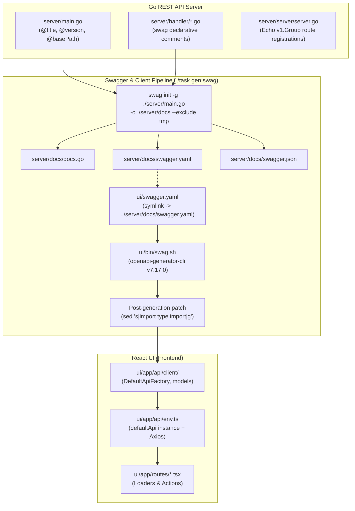

# API Swagger Workflow

This skill documents the complete API change lifecycle for the `pneutrinoutil` project, tracing an endpoint from Go handler implementation to Swagger/OpenAPI documentation generation and TypeScript Axios client regeneration for the frontend UI.

---

## 1. Overview

`pneutrinoutil` uses a **Swagger-driven, code-first API development workflow**:
- **Single Source of Truth**: Backend Go handler annotations in [`server/handler/*.go`](server/handler) and top-level server metadata in [`server/main.go`](server/main.go).
- **Generated Backend Documentation**:
  - [`server/docs/swagger.yaml`](server/docs/swagger.yaml): OpenAPI specification in YAML.
  - [`server/docs/swagger.json`](server/docs/swagger.json): OpenAPI specification in JSON.
  - [`server/docs/docs.go`](server/docs/docs.go): Embedded Swagger specification compiled directly into the Go server binary for Swagger UI serving (`/v1/swagger/*`).
- **Symlink Contract**:
  - [`ui/swagger.yaml`](ui/swagger.yaml) is a symbolic link pointing to `../server/docs/swagger.yaml`.
  - Ensures the UI generator always consumes the backend's exact contract without duplicating files.
- **Generated Frontend Client**:
  - TypeScript Axios client generated in [`ui/app/api/client/`](ui/app/api/client) via `@openapitools/openapi-generator-cli`.



---

## 2. Step-by-Step Workflow for API Changes

When adding a new endpoint or modifying an existing endpoint, execute the following steps **IN STRICT ORDER**:

### Step 1: Modify Go Handler

1. Edit or add the handler function in [`server/handler/`](server/handler) (e.g., [`start.go`](server/handler/start.go), [`get.go`](server/handler/get.go), or [`search.go`](server/handler/search.go)).
2. Place declarative `swag` annotations directly above the handler function.
3. Use proper annotations: `@Summary`, `@Description`, `@Tags`, `@Accept`, `@Produce`, `@Param`, `@Success`, `@Failure`, `@Header`, and `@Router`.

#### Example Annotation Pattern: Form Data Upload ([`server/handler/start.go`](server/handler/start.go))
```go
// @Summary     Start synthesis process
// @Description Upload MusicXML and start synthesis
// @Tags        proc
// @Accept      multipart/form-data
// @Produce     json
// @Param       score         formData  file    true  "MusicXML score file"
// @Param       model         formData  string  false "Singer model name"
// @Param       supportModel  formData  string  false "Support model name"
// @Param       transpose     formData  integer false "Transpose value"
// @Success     202
// @Failure     400  {object}  echo.HTTPError
// @Failure     500  {object}  echo.HTTPError
// @Router      /proc [post]
func (s *Start) Handler(c *echo.Context) error {
    // ...
}
```

#### Example Annotation Pattern: Query Parameters & Typed JSON Envelopes ([`server/handler/search.go`](server/handler/search.go))
```go
// @summary     search processes
// @description search processes by status, created_at, title prefix, order by created_at desc
// @tags        proc
// @param       limit   query int    false "query limit; default: 5"
// @param       prefix  query string false "title prefix"
// @param       status  query string false "process status; (pending|running|succeed|failed)"
// @param       start   query string false "created_at"
// @param       end     query string false "created_at"
// @produce     json
// @success     200 {object} handler.SuccessResponse[SearchProcessResponseData]
// @failure     400 {object} handler.ErrorResponse
// @failure     500 {object} handler.ErrorResponse
// @router      /proc/search [get]
func (s *Search) SearchProcess(c *echo.Context) error {
    // ...
}
```

#### Example Annotation Pattern: Path Parameter & Binary Streaming ([`server/handler/get.go`](server/handler/get.go))
```go
// @summary     download wav
// @description download wav file generated by pneutrinoutil
// @tags        proc
// @param       id path string true "request id"
// @produce     octet-stream
// @success     200 {string} file
// @failure     404 {object} handler.ErrorResponse
// @router      /proc/{id}/wav [get]
func (g *Get) Wav(c *echo.Context) error {
    // ...
}
```

---

### Step 2: Register Route (if new endpoint)

Register the newly implemented endpoint in [`server/server/server.go`](server/server/server.go):

1. Endpoints are grouped under `v1 := e.Group("/v1")`.
2. Standard route registration pattern:
   ```go
   r := v1.GET("/path", handler.Method)
   r.Name = "operationName"
   ```
   Or for POST endpoints:
   ```go
   r := v1.POST("/proc", startHandler.Handler)
   r.Name = "createProcess"
   ```
3. Subgroups are used for parameterized paths:
   ```go
   getGroup := v1.Group("/proc/:id")
   r6 := getGroup.GET("/detail", getHandler.Detail)
   r6.Name = "getDetail"
   ```
4. Always set `r.Name` on each route to facilitate logging, debugging, and route inspection via `/v1/debug`.

---

### Step 3: Regenerate Swagger & TypeScript Client

Run the code generation task:
```bash
./task gen:swag
```

Under the hood, this executes two operations defined in [`mise.toml`](mise.toml):

1. **Backend Swagger Generation**:
   ```bash
   ./tools/run.sh swag init -g ./server/main.go -o ./server/docs --exclude tmp
   ```
   - Parses top-level metadata in [`server/main.go`](server/main.go) and swag comments across all handlers.
   - Generates [`server/docs/swagger.yaml`](server/docs/swagger.yaml), [`server/docs/swagger.json`](server/docs/swagger.json), and [`server/docs/docs.go`](server/docs/docs.go).

2. **Frontend Client Generation** (`ui/bin/swag.sh` triggered via `mise run ui:gen-swag`):
   - Cleans previously generated documentation:
     ```bash
     rm -rf app/api/client/docs
     ```
   - Generates TypeScript Axios client based on [`ui/swagger.yaml`](ui/swagger.yaml) (the symlink to [`server/docs/swagger.yaml`](server/docs/swagger.yaml)):
     ```bash
     openapi-generator-cli generate -i ./swagger.yaml -g typescript-axios -o app/api/client
     ```
   - Applies the required post-generation import patch:
     ```bash
     sed -i 's|import type|import|g' app/api/client/api.ts
     ```
     *(Uses `gsed` if available on macOS, falling back to standard `sed`)*.

> [!NOTE]
> OpenAPI Generator CLI version is pinned to `7.17.0` in [`ui/openapitools.json`](ui/openapitools.json).

---

### Step 4: Update UI Code (if needed)

The newly generated methods and request/response types in [`ui/app/api/client/`](ui/app/api/client) are now available to the frontend.

#### Client Instantiation in [`ui/app/api/env.ts`](ui/app/api/env.ts)
```typescript
import { DefaultApiFactory, Configuration } from "./client";
import { enableAxiosLogger } from "./log";
import axios from "axios";

const {
  API_CLIENT_TIMEOUT_MS,
  SERVER_URI,
  EXTERNAL_SERVER_URI,
} = process.env;

const axiosInstance = enableAxiosLogger(axios.create({
  baseURL: SERVER_URI,
  timeout: parseInt(API_CLIENT_TIMEOUT_MS || "3000", 10) || 3000,
}));

const configuration = new Configuration({
  basePath: SERVER_URI,
});
const defaultApi = DefaultApiFactory(configuration, undefined, axiosInstance);

const apiServerUri = EXTERNAL_SERVER_URI;

export { apiServerUri, defaultApi };
```

#### Calling `defaultApi` in Route Loaders & Actions
- **Route Loader Pattern** ([`ui/app/routes/home.tsx`](ui/app/routes/home.tsx)):
  ```typescript
  import { defaultApi } from "../api/env";

  export async function loader({ request }: Route.LoaderArgs) {
    const url = new URL(request.url);
    const searchParams = url.searchParams;
    // ... parse params
    const r = await defaultApi.procSearchGet(limit, prefix, status, start, end);
    return r.data.data;
  }
  ```
- **Route Action Pattern** ([`ui/app/routes/create.tsx`](ui/app/routes/create.tsx)):
  ```typescript
  import { defaultApi } from "../api/env";

  export async function action({ request }: Route.ActionArgs) {
    const d = await request.formData();
    const r = await defaultApi.procPost(
      d.get("score") as File,
      d.get("model") as any,
      d.get("supportModel") as any,
      d.get("transpose") as any,
    );
    return {
      ok: true,
      data: r.headers["x-request-id"],
    };
  }
  ```

#### Relevant Environment Variables
| Variable | Description | Default |
| :--- | :--- | :--- |
| `SERVER_URI` | Base REST API server URL accessed by Node server-side loaders/actions | Set by deployment / local dev (`http://localhost:9101`) |
| `API_CLIENT_TIMEOUT_MS` | Axios HTTP request timeout in milliseconds | `3000` |
| `EXTERNAL_SERVER_URI` | Public server URL consumed by client browser for direct asset downloads | Same as server host/port |

---

### Step 5: Verify

Verify all backend and frontend changes using the task runner:

1. **Verify UI TypeScript Types**:
   ```bash
   ./task ui-lint
   ```
   Runs `pnpm run typecheck` (`react-router typegen && tsc`) in `ui/`. Ensures route components, loaders, and actions correctly match the generated client signatures.

2. **Run Go Unit Tests**:
   ```bash
   ./task test:unit
   ```
   Executes all unit tests with coverage (`go test -cover ./...`), ensuring handlers, routes, and repositories function as expected.

3. **Verify Full System Compilation**:
   ```bash
   ./task build
   ```
   Compiles all binaries (`cli`, `server`, `worker`, `mockcli`, `gendata`) and tests container build configurations.

---

## 3. Swagger Annotation Conventions

Follow these project-wide conventions when annotating handlers:

### Server-Level Metadata
Top-level Swagger specifications reside in [`server/main.go`](server/main.go):
```go
// @title       pneutrinoutil API
// @version     1.0
// @description pneutrinoutil http server
// @host        localhost:9101
// @basePath    /v1
```

### Handler Annotation Reference Table
| Tag | Purpose | Example |
| :--- | :--- | :--- |
| `@Summary` | Single-sentence endpoint summary | `@Summary search processes` |
| `@Description` | Detailed explanation of endpoint behavior | `@Description search processes by status, created_at, title prefix` |
| `@Tags` | Logical grouping in Swagger UI / client API separation | `@Tags proc` |
| `@Accept` | Supported request content types | `@Accept json`, `@Accept multipart/form-data` |
| `@Produce` | Response content types | `@Produce json`, `@Produce octet-stream` |
| `@Param` | Request parameter declaration | `@Param id path string true "request id"`<br>`@Param limit query int false "limit; default: 5"`<br>`@Param score formData file true "musicxml"` |
| `@Success` | Successful HTTP status and return model | `@Success 200 {object} handler.SuccessResponse[MyType]`<br>`@Success 202`<br>`@Success 200 {string} file` |
| `@Failure` | Error HTTP status and model | `@Failure 400 {object} handler.ErrorResponse`<br>`@Failure 500 {object} echo.HTTPError` |
| `@Header` | Documented HTTP response headers | `@Header 202 {string} string x-request-id "request id, or just id"` |
| `@Router` | Route path relative to `@basePath` and HTTP verb | `@Router /proc [post]`, `@Router /proc/{id}/detail [get]` |

### Specific Project Conventions
1. **Tags**: All process-handling endpoints (`/proc`, `/proc/search`, `/proc/:id/*`) must use `@Tags proc`.
2. **Binary Responses**: Endpoints returning raw files (WAV audio, MusicXML files) use `@Produce octet-stream` and `@Success 200 {string} file`.
3. **Request IDs**: The server injects request IDs via Echo's `RequestID()` middleware. Endpoints that accept jobs return the ID in the `X-Request-Id` response header, documented with `@Header 202 {string} string x-request-id "request id, or just id"`.
4. **Standard Envelopes**:
   - Success responses use `handler.SuccessResponse[T]`.
   - Error responses use `handler.ErrorResponse` or `echo.HTTPError`.

---

## 4. Common Gotchas

> [!WARNING]
> **Always run `./task gen:swag` BEFORE `./task ui-lint`**
> The UI code relies on TypeScript interfaces generated in `ui/app/api/client/api.ts`. If you modify a Go handler and immediately execute `./task ui-lint`, TypeScript will check against stale API definitions, producing false positive compilation errors.

> [!IMPORTANT]
> **`ui/swagger.yaml` is a symlink, NOT a regular file**
> `ui/swagger.yaml` links to `../server/docs/swagger.yaml`. Never replace it with a manual file copy, delete it, or edit it directly. Any changes will be overwritten by `swag init`.

> [!NOTE]
> **The Post-Generation `sed` Patch is Mandatory**
> `openapi-generator-cli` generates `import type { AxiosInstance } from 'axios';` syntax in `app/api/client/api.ts`. Due to the project's TypeScript compilation setup, this syntax triggers build errors. The script [`ui/bin/swag.sh`](ui/bin/swag.sh) patches this with `sed -i 's|import type|import|g' app/api/client/api.ts`.

> [!CAUTION]
> **Never manually edit generated files in `ui/app/api/client/`**
> Any edits inside `ui/app/api/client/` (`api.ts`, `base.ts`, `configuration.ts`, etc.) will be erased when `./task gen:swag` runs. Place custom client configurations, interceptors, or helpers in [`ui/app/api/env.ts`](ui/app/api/env.ts) or sibling files in `ui/app/api/`.

> [!TIP]
> **Handler Tests Use Black-Box Test Packages**
> Handler tests in [`server/handler/common_test.go`](server/handler/common_test.go) use `package handler_test`. Any unit tests written for handlers must test through public handler interfaces.

---

## 5. Adding a New Endpoint: Checklist

Use this checklist whenever adding a new API endpoint to ensure complete integration:

- [ ] **Step 1:** Create or modify handler function in [`server/handler/`](server/handler).
- [ ] **Step 2:** Add complete Swagger annotations (`@Summary`, `@Description`, `@Tags`, `@Param`, `@Produce`, `@Success`, `@Failure`, `@Router`) above the handler function.
- [ ] **Step 3:** Register the route and assign route name (`r.Name = "..."`) in [`server/server/server.go`](server/server/server.go).
- [ ] **Step 4:** Run `./task gen:swag` to regenerate `server/docs/` and `ui/app/api/client/`.
- [ ] **Step 5:** Update UI route loader or action in [`ui/app/routes/`](ui/app/routes) to use the new `defaultApi` method.
- [ ] **Step 6:** Run `./task ui-lint` to verify TypeScript typing.
- [ ] **Step 7:** Run `./task test:unit` to verify Go unit tests.
- [ ] **Step 8:** Update the REST API Endpoints table in [`AGENTS.md`](AGENTS.md#L193-L210) if the endpoint signature or route was added/changed.
