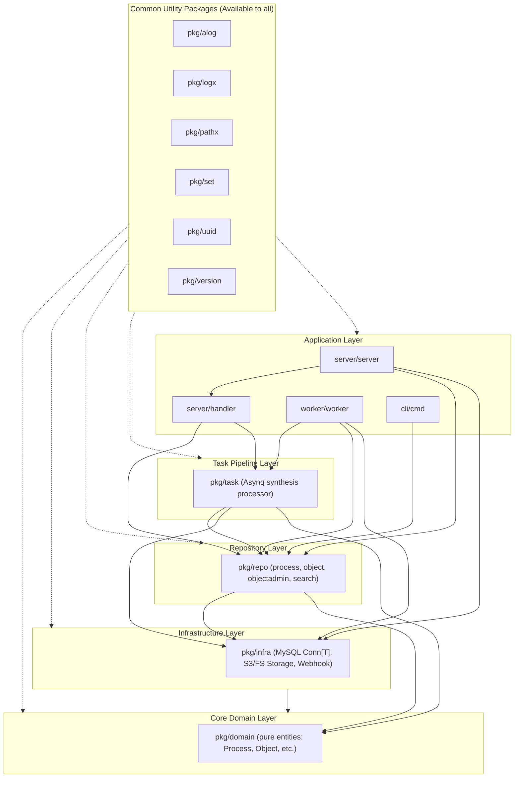

# Go Architecture and Layering Guidelines

This guide documents the strict layered Go architecture enforced in `pneutrinoutil`, the package inventory, allowed dependencies, code generation patterns, testing conventions, and the end-to-end process for extending the system with new entities and features.

---

## 1. Architectural Overview

The `pneutrinoutil` backend enforces a **strict bottom-up layered architecture**:
- Architectural rules are defined and checked automatically by [`go-arch-lint`](https://github.com/fe3dback/go-arch-lint) via [`.go-arch-lint.yml`](.go-arch-lint.yml).
- Compliance is verified as part of the primary linter suite:
  ```bash
  ./task lint
  # Or target architecture linting directly:
  ./task lint:go-arch-lint
  ```
  `./task lint:go-arch-lint` executes `./tools/run.sh go-arch-lint check` and renders an SVG dependency graph to `tmp/go-arch-lint.svg`.
- The architecture follows a strict bottom-up dependency model:
  $$\text{domain} \longrightarrow \text{infra} \longrightarrow \text{repo} \longrightarrow \text{task} \longrightarrow \text{server} / \text{worker} / \text{cli}$$
- **Zero Tolerance for Cyclic or Downward Violations**: Lower layers must NEVER import higher layers. Core domain entities have zero internal dependencies. Violations will immediately fail CI and local linter checks.



---

## 2. Package Inventory

Every Go package in the project has an explicit purpose, strictly delimited internal dependencies (`mayDependOn`), and permitted third-party vendor libraries (`canUse`).

### Summary of Architectural Boundaries

| Layer / Package | Path | Purpose | Allowed Internal Deps (`mayDependOn`) | Allowed Vendor Libraries (`canUse`) |
| :--- | :--- | :--- | :--- | :--- |
| **Domain** | [`pkg/domain`](pkg/domain) | Pure domain models, enums | **NONE** | Standard library only |
| **Infra** | [`pkg/infra`](pkg/infra) | DB connections, S3/FS storage, webhooks | `domain` | `mysql`, `aws` |
| **Repo** | [`pkg/repo`](pkg/repo) | CRUD interfaces, DB queries, blob bridging | `domain`, `infra` | (Common vendors only) |
| **Task** | [`pkg/task`](pkg/task) | Asynq background task pipeline | `domain`, `infra`, `repo` | `asynq` |
| **Common** | `pkg/{alog,logx,pathx,set,uuid,version}` | Reusable shared utilities | See package details | `google-uuid` (`uuid`), common vendors |
| **Handler** | [`server/handler`](server/handler) | HTTP Echo request handlers & Swagger docs | `domain`, `echox`, `repo`, `task`, `cli-ctl` | `echo`, `asynq` |
| **Server** | [`server/server`](server/server) | HTTP Echo router & DI assembly | `domain`, `infra`, `repo`, `server-config`, `server-handler` | `asynq`, `echo`, `swagger` |
| **Worker** | [`worker/worker`](worker/worker) | Asynq background worker execution | `domain`, `infra`, `repo`, `task`, `worker-config` | `asynq` |
| **CLI** | [`cli/cmd`](cli/cmd) | Cobra CLI commands | `cli-ctl`, `cli-task`, `cli-info` | `cobra`, `execx` |

> [!NOTE]
> `commonVendors` configured in [`.go-arch-lint.yml`](.go-arch-lint.yml) (`yaml`, `shellescape`) and `commonComponents` (`alog`, `domain`, `logx`, `pathx`, `set`, `version`) may be imported anywhere across all layers unless explicitly prohibited.

---

### Detailed Layer Descriptions

#### 1. Core Domain Layer ([`pkg/domain`](pkg/domain))

- **Path**: [`pkg/domain`](pkg/domain)
- **Allowed Dependencies**: **NONE** (zero internal dependencies; standard library `time` and `io` only).
- **Allowed Vendors**: **NONE**.
- **Role**: This is the innermost layer containing pure business models and enumerated types. It has no knowledge of databases, SQL, file systems, HTTP, or message queues.

**Files & Core Types:**
- [`pkg/domain/db.go`](pkg/domain/db.go):
  - [`Process`](pkg/domain/db.go#L7-L16): Entity tracking synthesis execution status, timestamps, and detail references.
  - [`ProcessStatus`](pkg/domain/db.go#L19-L56): Typed integer enum:
    - `ProcessStatusPending` (`1`)
    - `ProcessStatusRunning` (`2`)
    - `ProcessStatusSucceed` (`3`)
    - `ProcessStatusFailed` (`4`)
    - Helpers: `ProcessStatus.String()` and `ProcessStatusFromString(s string) (ProcessStatus, bool)`.
  - [`ProcessDetails`](pkg/domain/db.go#L58-L67): Synthesis execution parameters, command string, and score/log/result object foreign keys.
  - [`ObjectType`](pkg/domain/db.go#L70-L75): Typed integer enum:
    - `ObjectTypeFile` (`1`)
    - `ObjectTypeDir` (`2`)
  - [`Object`](pkg/domain/db.go#L77-L85): DB metadata describing stored blobs (bucket, path, size in bytes, type).
- [`pkg/domain/storage.go`](pkg/domain/storage.go):
  - [`StorageObject`](pkg/domain/storage.go#L5-L10): In-memory/stream representation of an object payload (`Bucket`, `Path`, `Blob io.ReadSeeker`, `SizeBytes`).

---

#### 2. Infrastructure Layer ([`pkg/infra`](pkg/infra))

- **Path**: [`pkg/infra`](pkg/infra)
- **Allowed Dependencies**: `domain`
- **Allowed Vendors**: `mysql` (`github.com/go-sql-driver/mysql`), `aws` (`github.com/aws/**`)
- **Role**: Concrete drivers and abstractions for persistent I/O, database transactions, object storage, and external webhooks.

**Key Files & Components:**
- [`pkg/infra/db.go`](pkg/infra/db.go):
  - Generic DB connection abstraction: [`Conn[T any]`](pkg/infra/db.go#L10-L18).
  - Query interface: [`Queryer[T any]`](pkg/infra/db.go#L38-L40) taking [`QueryRequest[T]`](pkg/infra/db.go#L20-L24) with caller-provided `Scan func(f func(...any) error) (*T, error)`.
  - Mutation interface: [`Execer`](pkg/infra/db.go#L136-L138) taking [`ExecRequest`](pkg/infra/db.go#L77-L81).
  - **Transaction Isolation**: All `Exec` calls wrap mutations in explicit transactions using `sql.LevelRepeatableRead`:
    ```go
    tx, err := conn.BeginTx(ctx, &sql.TxOptions{
        Isolation: sql.LevelRepeatableRead,
    })
    ```
  - **Post-Execution Assertions**: Automatically roll back the transaction if conditions fail:
    - [`AssertRowsAffected(rows int64)`](pkg/infra/db.go#L88-L95)
    - [`AssertLastInserted()`](pkg/infra/db.go#L97-L104)
    - [`AssertJoin(f ...func(*ExecResponse) error)`](pkg/infra/db.go#L106-L115)
- [`pkg/infra/sql.go`](pkg/infra/sql.go):
  - Connection pool configuration: [`SQLParam`](pkg/infra/sql.go#L11-L16) (`DSN`, `ConnMaxLifetime`, `MaxIdleConns`, `MaxOpenConns`).
  - [`NewSQL(ctx, param)`](pkg/infra/sql.go#L18-L34): Initializes `*sql.DB` and verifies connectivity via `PingContext` with a 1-second timeout.
- [`pkg/infra/storage.go`](pkg/infra/storage.go) & [`pkg/infra/storage_create.go`](pkg/infra/storage_create.go):
  - Unified storage interface: [`Object`](pkg/infra/storage.go#L16-L19) combining [`ObjectCreator`](pkg/infra/storage.go#L29-L31) and [`ObjectGetter`](pkg/infra/storage.go#L38-L40).
  - S3 backend: [`S3`](pkg/infra/storage.go#L52-L100) using AWS SDK v2, with path-style access for local MinIO / S3 emulation.
  - FileSystem backend: [`FileSystem`](pkg/infra/storage.go#L102-L156) for local directory storage.
  - Storage Factory: [`NewStorage(ctx, param)`](pkg/infra/storage_create.go#L22-L60) returns `S3` or `FileSystem` based on `param.UseS3`.
- [`pkg/infra/webhook.go`](pkg/infra/webhook.go):
  - [`Webhooker`](pkg/infra/webhook.go#L12-L14) interface and [`Webhook`](pkg/infra/webhook.go#L25-L55) struct sending HTTP POST notifications with JSON serialization and request timeouts.

---

#### 3. Repository Layer ([`pkg/repo`](pkg/repo))

- **Path**: [`pkg/repo`](pkg/repo)
- **Allowed Dependencies**: `domain`, `infra`
- **Role**: Mediates between domain objects and data infrastructure. Repositories manage database tables, dynamic SQL queries, and bridge DB metadata with physical object storage.

**Key Files & Components:**
- [`pkg/repo/process.go`](pkg/repo/process.go):
  - Interfaces: [`ProcessCreator`](pkg/repo/process.go#L26-L28), [`ProcessUpdater`](pkg/repo/process.go#L30-L33), [`ProcessGetter`](pkg/repo/process.go#L35-L39) (by ID, RequestID, DetailsID).
  - Implementation: `Process` backed by `infra.Queryer[domain.Process]` and `infra.Execer`.
- [`pkg/repo/process_details.go`](pkg/repo/process_details.go):
  - Interfaces: [`ProcessDetailsCreator`](pkg/repo/process_details.go#L24-L26), [`ProcessDetailsUpdater`](pkg/repo/process_details.go#L28-L31), [`ProcessDetailsGetter`](pkg/repo/process_details.go#L33-L35).
  - Implementation: `ProcessDetails` backed by `infra.Queryer[domain.ProcessDetails]` and `infra.Execer`.
- [`pkg/repo/object.go`](pkg/repo/object.go):
  - Interfaces:
    - [`ObjectCreator`](pkg/repo/object.go#L23-L25): Exposes method `CteateObject(ctx, req)`
      > [!IMPORTANT]
      > The typo `CteateObject` is intentional in the codebase. Do **NOT** rename or "fix" this method without coordinating breaking changes across all callers!
    - [`ObjectGetter`](pkg/repo/object.go#L27-L30): `GetObject(ctx, id)` and `GetObjectByPath(ctx, bucket, path)`.
  - Implementation: `Object` backed by `infra.Queryer[domain.Object]` and `infra.Execer`.
- [`pkg/repo/objectadmin.go`](pkg/repo/objectadmin.go):
  - Bridges SQL DB metadata records (`repo.Object`) with physical binary blobs in S3/FileSystem (`infra.Object`).
  - Interfaces: [`ObjectReader`](pkg/repo/objectadmin.go#L17-L19) (`ReadObject`) and [`ObjectWriter`](pkg/repo/objectadmin.go#L32-L34) (`WriteObject`).
- [`pkg/repo/search.go`](pkg/repo/search.go):
  - [`ProcessSearcher`](pkg/repo/search.go#L24-L26) interface: Executes dynamic SQL queries with filters on `status_id`, `title` (prefix `LIKE ?%`), and `created_at` timestamp ranges (`Range[time.Time]`), ordered by `created_at DESC` with limit.
- [`pkg/repo/common.go`](pkg/repo/common.go):
  - [`Range[T any]`](pkg/repo/common.go#L3-L13) generic interval struct (`Left *T`, `Right *T`, `NewRange`).

---

#### 4. Task Pipeline Layer ([`pkg/task`](pkg/task))

- **Path**: [`pkg/task`](pkg/task)
- **Allowed Dependencies**: `domain`, `infra`, `repo`
- **Allowed Vendors**: `asynq` (`github.com/hibiken/asynq`)
- **Role**: Asynchronous job orchestration and synthesis pipeline execution.

**Key Files & Components:**
- [`pkg/task/task.go`](pkg/task/task.go):
  - Task type constant: `TypePneutrinoutilStart = "pneutrinoutil:start"`
  - Task factory: [`NewPneutrinoutilStart(payload)`](pkg/task/task.go#L35-L42)
  - Execution engine: [`PneutrinoutilProcessor`](pkg/task/task.go#L76-L82) implementing `asynq.Handler.ProcessTask`. Coordinates the full execution flow:
    1. Sets process status to `Running` via `repo.ProcessUpdater`.
    2. Downloads input score blob via `repo.ObjectReader`.
    3. Executes the NEUTRINO synthesis CLI (or mockcli) via `os/exec`.
    4. Writes execution stdout/stderr logs into storage via `repo.ObjectWriter`.
    5. Writes generated audio WAV and MusicXML artifacts via `repo.ObjectWriter`.
    6. Updates `process_details` record with output object foreign keys.
    7. Sets final process status to `Succeed` (or `Failed` on error).
    8. Dispatches webhook notification via `infra.Webhooker` if configured.

---

#### 5. Common Packages (Available to All Layers)

Configured as `commonComponents` in [`.go-arch-lint.yml`](.go-arch-lint.yml). Any package may import these:

- [`pkg/alog`](pkg/alog): Application-wide singleton structured logger.
  - Access via [`alog.L()`](pkg/alog/log.go#L24-L26) (`Debug`, `Info`, `Warn`, `Error`).
  - Configure via [`alog.Setup(w io.Writer, level slog.Leveler)`](pkg/alog/log.go#L30-L32).
- [`pkg/logx`](pkg/logx): Logging extensions and formatters.
  - LTSV handler: [`NewLTSVLogger`](pkg/logx/log.go#L19-L22), [`NewLTSVHandler`](pkg/logx/log.go#L29-L34).
  - Helper attributes: [`logx.Err(err)`](pkg/logx/util.go#L9-L14), [`logx.JSON(key, val)`](pkg/logx/util.go#L21-L23), [`logx.Array(key, vals...)`](pkg/logx/util.go#L25-L31).
- [`pkg/pathx`](pkg/pathx): Filesystem helpers.
  - Functions: [`EnsureDir`](pkg/pathx/path.go#L17-L25), [`EnsureFile`](pkg/pathx/path.go#L27-L35), [`Exist`](pkg/pathx/path.go#L60-L65), [`Basename`](pkg/pathx/path.go#L95-L104).
  - Result naming: [`ResultElement`](pkg/pathx/result.go#L20-L25) and [`ParseResultElement`](pkg/pathx/result.go#L52-L82) for standard result naming patterns (`basename__YYYYMMDDHHMMSS_timestamp_salt`).
- [`pkg/set`](pkg/set): Generic mathematical set [`Set[T comparable]`](pkg/set/set.go#L13) with `In`, `Len`, `Diff`, and `IntoSlice`.
- [`pkg/uuid`](pkg/uuid): UUID generator wrapper (`uuid.New() string`).
- [`pkg/version`](pkg/version): Build-time version metadata (`Version`, `Revision`, `BuildDate`, `GoVersion`).

---

#### 6. Application Layer

The outermost layer contains runnable binaries, HTTP servers, workers, and CLI tools:

- **`server/handler`**:
  - May depend on: `domain`, `echox`, `repo`, `task`, `cli-ctl`
  - Can use vendors: `echo`, `asynq`
  - Encapsulates Echo HTTP handlers ([`start.go`](server/handler/start.go), [`get.go`](server/handler/get.go), [`search.go`](server/handler/search.go), [`health.go`](server/handler/health.go)).
  - Contains Swagger declarative comments (`// @summary`, `// @router`).
- **`server/server`**:
  - May depend on: `domain`, `infra`, `repo`, `server-config`, `server-handler`
  - Can use vendors: `asynq`, `echo`, `swagger`
  - Wires dependency injection, sets up middleware (structured LTSV access logs), registers routes, and handles graceful shutdown.
- **`worker/worker`**:
  - May depend on: `domain`, `infra`, `repo`, `task`, `worker-config`
  - Can use vendors: `asynq`
  - Sets up the Asynq worker server and registers `PneutrinoutilProcessor` handlers.
- **`cli/cmd`**:
  - May depend on: `cli-ctl`, `cli-task`, `cli-info`
  - Can use vendors: `cobra`, `execx`
  - Builds the command hierarchy (`root`, `task`, `info`, `version`) for the standalone CLI.

---

## 3. Code Generation Patterns

### goconfig (Go Tool Dependency)

The project uses [`github.com/berquerant/goconfig`](https://github.com/berquerant/goconfig) for type-safe functional configuration builders.

- **Tool declaration in [`go.mod`](go.mod#L5)**:
  ```text
  tool github.com/berquerant/goconfig
  ```
- **Directive in code** (e.g., [`pkg/pathx/path.go`](pkg/pathx/path.go#L10)):
  ```go
  //go:generate go tool goconfig -field "Mode os.FileMode|Truncate bool" -option -output path_config_generated.go
  ```
- **Generated Output**: Produces `*_generated.go` containing `ConfigBuilder`, `ConfigOption`, `WithMode`, `WithTruncate`, etc.
- **Task Commands**:
  - Clean generated files:
    ```bash
    ./task gen:clean
    ```
    (Executes `find . -name "*_generated.go" -type f -delete` and cleans tools).
  - Regenerate all code and Swagger specs:
    ```bash
    ./task gen
    ```
    (Executes `go generate ./...` followed by `swag init` and UI client generation).

---

### Build Metadata Injection via ldflags

Binaries are compiled with [`bin/build.sh`](bin/build.sh), which injects build metadata into [`pkg/version`](pkg/version/version.go) at compile time:

```bash
readonly version_package="github.com/berquerant/pneutrinoutil/pkg/version"

ldflags() {
    echo "-X ${version_package}.Version=$(current_tag) -X ${version_package}.Revision=$(short_sha) -X ${version_package}.BuildDate=$(build_date)"
}
```

- `pkg/version.Version`: Extracted from [`VERSION`](VERSION) file (e.g., `v0.1.0`).
- `pkg/version.Revision`: Short Git commit hash (`git rev-parse --short HEAD`).
- `pkg/version.BuildDate`: UTC timestamp (`date -u +'%Y-%m-%dT%H:%M:%SZ'`).

---

## 4. How to Add a New Domain Entity (End-to-End)

Follow this step-by-step procedure when introducing a new entity (e.g., `Notification`):

### Step 1: Define Entity in `pkg/domain`
Create `pkg/domain/notification.go`. Ensure **zero internal dependencies**!
```go
package domain

import "time"

type NotificationType int

const (
    NotificationTypeEmail NotificationType = iota + 1
    NotificationTypeWebhook
)

type Notification struct {
    ID        int
    ProcessID int
    Type      NotificationType
    Target    string
    SentAt    *time.Time
    CreatedAt time.Time
    UpdatedAt time.Time
}
```

### Step 2: Add Database DDL
Add the table definition in [`charts/pneutrinoutil/templates/mysql/_helpers.tpl`](charts/pneutrinoutil/templates/mysql/_helpers.tpl):
```sql
CREATE TABLE IF NOT EXISTS notifications (
  id INT AUTO_INCREMENT PRIMARY KEY,
  process_id INT NOT NULL,
  type_id INT NOT NULL,
  target VARCHAR(2048) NOT NULL,
  sent_at TIMESTAMP NULL,
  created_at TIMESTAMP DEFAULT CURRENT_TIMESTAMP,
  updated_at TIMESTAMP DEFAULT CURRENT_TIMESTAMP ON UPDATE CURRENT_TIMESTAMP,

  INDEX process_id_idx (process_id),
  CONSTRAINT fk_notif_process_id FOREIGN KEY (process_id) REFERENCES processes(id)
);
```

### Step 3: Implement Repository in `pkg/repo`
Create `pkg/repo/notification.go`. Depend only on `domain` and `infra`:
```go
package repo

import (
    "context"
    "time"

    "github.com/berquerant/pneutrinoutil/pkg/domain"
    "github.com/berquerant/pneutrinoutil/pkg/infra"
)

type NotificationCreator interface {
    CreateNotification(ctx context.Context, notif *domain.Notification) (*domain.Notification, error)
}

type NotificationGetter interface {
    GetNotification(ctx context.Context, id int) (*domain.Notification, error)
}

type NotificationRepo struct {
    query infra.Queryer[domain.Notification]
    exec  infra.Execer
}

func NewNotificationRepo(query infra.Queryer[domain.Notification], exec infra.Execer) *NotificationRepo {
    return &NotificationRepo{query: query, exec: exec}
}

func (r *NotificationRepo) scan(f func(...any) error) (*domain.Notification, error) {
    var (
        n domain.Notification
        typeId int
    )
    if err := f(&n.ID, &n.ProcessID, &typeId, &n.Target, &n.SentAt, &n.CreatedAt, &n.UpdatedAt); err != nil {
        return nil, err
    }
    n.Type = domain.NotificationType(typeId)
    return &n, nil
}
```

### Step 4: Create Handler in `server/handler`
Add `server/handler/notification.go` with Swagger documentation annotations:
```go
package handler

import (
    "net/http"
    "strconv"

    "github.com/berquerant/pneutrinoutil/pkg/repo"
    "github.com/labstack/echo/v5"
)

type NotificationHandler struct {
    getter repo.NotificationGetter
}

func NewNotificationHandler(getter repo.NotificationGetter) *NotificationHandler {
    return &NotificationHandler{getter: getter}
}

// GetNotification returns a notification by ID.
//
// @summary     get notification
// @description get notification by ID
// @tags        notification
// @produce     json
// @param       id   path     int true "Notification ID"
// @success     200  {object} handler.SuccessResponse[domain.Notification]
// @failure     404  {object} handler.ErrorResponse
// @router      /notification/{id} [get]
func (h *NotificationHandler) Get(c *echo.Context) error {
    id, err := strconv.Atoi(c.PathParam("id"))
    if err != nil {
        return Error(c, http.StatusBadRequest, "invalid id")
    }
    n, err := h.getter.GetNotification(c.Request().Context(), id)
    if err != nil {
        return Error(c, http.StatusNotFound, "notification not found")
    }
    return Success(c, http.StatusOK, n)
}
```

### Step 5: Register Route in `server/server/server.go`
Wire dependencies and register routes under `/v1`:
```go
notifConn := infra.NewConn[domain.Notification](db)
notifRepo := repo.NewNotificationRepo(notifConn, notifConn)
notifHandler := handler.NewNotificationHandler(notifRepo)

rNotif := v1.GET("/notification/:id", notifHandler.Get)
rNotif.Name = "getNotification"
```

### Step 6: Regenerate Specs and Client
```bash
./task gen:swag
```
This updates backend Swagger definitions in `server/docs/` and regenerates the TypeScript Axios client in `ui/app/api/client/`.

### Step 7: Integrate in UI
Use the newly generated method on `defaultApi` in `ui/app/routes/`:
```typescript
import { defaultApi } from "../api/env";

export async function loader({ params }: Route.LoaderArgs) {
  const res = await defaultApi.notificationIdGet(Number(params.id));
  return { notification: res.data.data };
}
```

### Step 8: Verify Complete Build and Tests
```bash
./task lint
./task test:unit
./task build
```

---

## 5. Architecture Violation Examples

The following patterns violate [`.go-arch-lint.yml`](.go-arch-lint.yml) and will cause `go-arch-lint` to fail:

| Violation | Description | Why it is forbidden |
| :--- | :--- | :--- |
| ❌ `pkg/domain` importing `pkg/repo` | Core layer importing repository | Domain must be pure entities with zero internal dependencies. |
| ❌ `pkg/infra` importing `pkg/repo` | Infra layer importing repository | Infrastructure provides raw DB/I/O connections; it must not know about domain repositories. |
| ❌ `pkg/repo` importing `pkg/task` | Repository importing task pipeline | Downward dependency: task depends on repo, repo cannot depend on task. |
| ❌ `server/handler` importing `pkg/infra` directly | Handler accessing raw database driver | Handlers must interact with persistence solely through `pkg/repo` interfaces. |
| ❌ Using `github.com/aws/**` in `pkg/repo` | Vendor leak outside designated layer | AWS SDK is restricted exclusively to `pkg/infra`. Repositories use `infra.Object` abstractions. |
| ❌ `pkg/repo` importing `github.com/go-sql-driver/mysql` | Raw driver vendor leak | MySQL driver registration is restricted to `pkg/infra/sql.go`. |

### Example Linter Failure Output
When an architectural violation is committed, `./task lint:go-arch-lint` will fail with an error like:
```text
[ERROR] Dependency server-handler -> infra not allowed
[ERROR] File: server/handler/get.go:12
[ERROR] Reason: component 'server-handler' can not depend on 'infra'
```
Fix the violation by introducing an interface in `pkg/repo` or injecting the abstraction from `server/server`.

---

## 6. Testing Conventions for Go Code

When writing Go tests across any package, adhere to the project testing standards:

1. **Black-Box Test Packages**:
   - Always use `package <name>_test` (e.g., `package infra_test`, `package repo_test`, `package handler_test`).
   - Forces tests to exercise only the public API, ensuring clean encapsulation.
2. **Standard Assertion Library**:
   - Use `github.com/stretchr/testify/assert` (or `require` when precondition failures should halt execution).
3. **Table-Driven Tests with Subtests**:
   - Use `t.Run(tc.name, func(t *testing.T) { ... })` for structured, discoverable test cases.
4. **Helper Functions**:
   - Always call `t.Helper()` inside setup, teardown, and custom assertion functions to preserve accurate line numbers in test failure outputs.
5. **Filesystem Isolation**:
   - Never write to static or system directories. Use `t.TempDir()` to provide isolated temporary workspaces that Go cleans up automatically.

### Example Unit Test Pattern
```go
package pathx_test

import (
    "os"
    "path/filepath"
    "testing"

    "github.com/berquerant/pneutrinoutil/pkg/pathx"
    "github.com/stretchr/testify/assert"
)

func TestEnsureDir(t *testing.T) {
    t.Parallel()

    tests := []struct {
        name    string
        subDir  string
        wantErr bool
    }{
        {
            name:   "create new nested directory",
            subDir: "nested/test/dir",
        },
    }

    for _, tc := range tests {
        t.Run(tc.name, func(t *testing.T) {
            dir := filepath.Join(t.TempDir(), tc.subDir)
            err := pathx.EnsureDir(dir)
            if tc.wantErr {
                assert.Error(t, err)
                return
            }
            assert.NoError(t, err)
            info, err := os.Stat(dir)
            assert.NoError(t, err)
            assert.True(t, info.IsDir())
        })
    }
}
```
