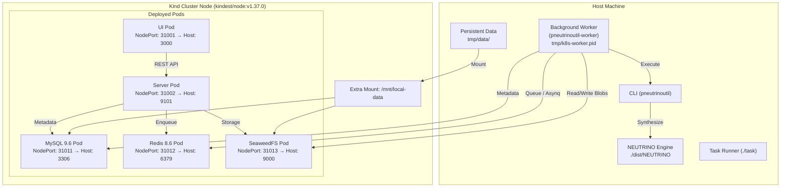

# Local Development Environment Guide

This guide documents how to set up, operate, test, and debug the local development environment for `pneutrinoutil`.

---

## 1. Prerequisites

All dependencies and environment configurations are managed via [mise](https://mise.jdx.dev/). There are **no `.env` files** in this repository; all environment variables and tasks are centrally declared in [`mise.toml`](mise.toml).

### Toolchain

The following core tools are specified in [`mise.toml`](mise.toml):

| Tool | Version | Purpose |
| :--- | :--- | :--- |
| **Go** | `1.27.1` | Backend REST API server, CLI, and task worker |
| **Node.js** | `24.20.0` | Frontend JavaScript runtime |
| **pnpm** | `12.3.4` | Fast frontend package manager |
| **Kind** | `0.33.0` | Local Kubernetes in Docker cluster |
| **kubectl** | `1.37.0` | Kubernetes CLI |
| **Helm** | `4.2.4` | Kubernetes package manager / deployment |
| **stern** | `1.34.0` | Multi-pod log tailing tool |
| **golangci-lint** | `2.13.2` | Go linting suite |
| **swag** | `1.16.6` | Swagger OpenAPI doc generator |
| **yq** | `4.53.6` | Command-line YAML processor |
| **ls-lint** | `2.3.1` | File and directory name linter |
| **shellcheck** | `0.11.0` | Shell script linter |
| **go-arch-lint** | `1.18.0` | Architectural dependency validator |
| **Python / uv** | `3.14.7` / `0.12.10` | Python runtime and linter execution (`yamllint`) |

### Initial Setup

To install all required tools and prepare the workspace:

```bash
# 1. Install all tools defined in mise.toml
mise install

# 2. Initialize development environment (ensures tmp directory and ignore modules exist)
./task init
```

> [!NOTE]
> The `./task` script is a lightweight wrapper that forwards commands to `mise run "$@"`. Running `./task <task-name>` is equivalent to running `mise run <task-name>`.

---

## 2. Local Kubernetes Cluster (Kind)

The project uses [Kind](https://kind.sigs.k8s.io/) (Kubernetes in Docker) to spin up local infrastructure dependencies (MySQL, Redis, S3 SeaweedFS) as well as containerized server and UI deployments.



### Starting the Cluster

To bootstrap the entire cluster and deploy the application stack:

```bash
./task k8s
```

This task automatically executes four stages:
1. **Cluster Creation / Re-creation** (`k8s:reload-cluster`): Deletes any stale cluster and provisions a new one using [`.cluster.yaml`](.cluster.yaml).
2. **Image Building** (`build:images`): Builds container images (`curl`, `server`, `ui`) via `docker buildx bake` based on [`docker-bake.hcl`](docker-bake.hcl).
3. **Image Loading** (`k8s:load-images`): Loads the built local Docker images directly into the Kind control plane node.
4. **Helm Deployment** (`k8s:deploy`): Executes [`bin/deploy.sh`](bin/deploy.sh) (`helm upgrade --install`) and restarts the host worker (`run:reload-k8s-worker`).

### Cluster Configuration (`.cluster.yaml`)

Configuration is declared in [`.cluster.yaml`](.cluster.yaml):
- **Cluster Name**: `pneutrinoutil` (configurable via `KIND_CLUSTER_NAME`)
- **Node Image**: `kindest/node:v1.37.0` (configurable via `KIND_NODE_IMAGE`)
- **Port Mappings (NodePort → Host)**:
  | Service | Container Port | Host Port | Protocol / Purpose |
  | :--- | :--- | :--- | :--- |
  | **Server** | `31002` | `9101` | Echo REST API |
  | **UI** | `31001` | `3000` | Web Application Frontend |
  | **MySQL** | `31011` | `3306` | Relational Metadata DB |
  | **Redis** | `31012` | `6379` | Asynq Job Queue & State |
  | **S3 (SeaweedFS)** | `31013` | `9000` | S3 Object Storage API |
  | **S3 Admin** | `31014` | `23646` | SeaweedFS Admin Console |
- **Persistent Storage Mount**: The host directory `tmp/data` is mounted to `/mnt/local-data` inside the Kind node to retain database and object storage volumes between container restarts.

### Stopping the Cluster

To cleanly tear down the cluster and kill any active worker processes:

```bash
./task k8s:stop
```

This executes `run:stop-k8s-worker` (terminates the background worker on the host) and `k8s:delete-cluster` (`kind delete cluster`).

To completely purge persisted MySQL and SeaweedFS volume data on the host, run:
```bash
./task k8s:purge
```

---

## 3. Helm Chart (`charts/pneutrinoutil/`)

Application manifests are packaged in the Helm chart located at [`charts/pneutrinoutil/`](charts/pneutrinoutil):
- **Chart Definition**: [`charts/pneutrinoutil/Chart.yaml`](charts/pneutrinoutil/Chart.yaml) (`version: 0.1.0`, `appVersion: "0.9.0"`)
- **Default Values**: [`charts/pneutrinoutil/values.yaml`](charts/pneutrinoutil/values.yaml)
- **Test Overrides**: [`test-values.yaml`](test-values.yaml) (switches DB names to `test`, Redis DB to `10`, S3 bucket to `test`, and uses Deployment manifests instead of StatefulSet)

### Services Deployed

| Component | Workload Type | Image | Storage / Initialization |
| :--- | :--- | :--- | :--- |
| **MySQL** | `StatefulSet` | `mysql:9.6.0` | PV/PVC hostPath at `/mnt/local-data/mysql`. A post-install Kubernetes Job runs DDL migrations defined in `templates/mysql/job.yaml`. |
| **Redis** | `Deployment` | `redis:8.6.1` | In-memory key-value store and Asynq broker. |
| **SeaweedFS** | `StatefulSet` | `chrislusf/seaweedfs:4.17` | S3-compatible object store. PV/PVC hostPath at `/mnt/local-data/s3`. A post-install Job (`amazon/aws-cli:2.34.13`) provisions the initial bucket. |
| **Server** | `Deployment` | `pneutrinoutil/server:local` | Echo REST API serving requests on port 9101. |
| **UI** | `Deployment` | `pneutrinoutil/ui:local` | Nginx/static bundle serving the web interface on port 3000. |

### Manual Deployment

To apply chart changes without destroying the Kind cluster:

```bash
# Deploy default values
./bin/deploy.sh

# Deploy with test values
./bin/deploy.sh -f test-values.yaml
```

The [`bin/deploy.sh`](bin/deploy.sh) script automatically launches background monitors (`kubectl get pod -o wide --watch` and `stern --tail 10 pneutrinoutil`), runs `helm upgrade --install --wait-for-jobs`, and cleans up monitors on exit.

---

## 4. Worker Management

> [!IMPORTANT]
> The NEUTRINO worker **does not run inside Kubernetes**. It runs directly on the **host machine** because the NEUTRINO synthesis engine requires native host platform binaries (C++ runtimes, shared libraries, and singer models).

The worker process is managed via [`bin/k8s-worker.sh`](bin/k8s-worker.sh):

```bash
# Start background worker on host
./bin/k8s-worker.sh start

# Stop background worker
./bin/k8s-worker.sh stop
```

### Worker State Tracking
- **Process ID**: Written to [`tmp/k8s-worker.pid`](tmp/k8s-worker.pid).
- **Log File**: Written to [`tmp/k8s-worker.log`](tmp/k8s-worker.log).

### Reloading After Code Changes

When Go source files in `pkg/`, `worker/`, or `cli/` are modified, rebuild and restart the worker with a single task:

```bash
./task run:reload-k8s-worker
```

This dependency chain executes:
1. `./task build:cli` → compiles [`dist/pneutrinoutil`](dist/pneutrinoutil)
2. `./task build:worker` → compiles [`dist/pneutrinoutil-worker`](dist/pneutrinoutil-worker)
3. Stops the running worker (`bin/k8s-worker.sh stop`)
4. Starts a fresh worker with updated binaries (`bin/k8s-worker.sh start`)

---

## 5. Service CLI Helpers

The `bin/` directory provides convenient CLI wrappers that connect directly into the Kubernetes cluster.

### MySQL (`bin/mysql.sh`)

Connects to the MySQL pod via `kubectl exec -it sts/pneutrinoutil-mysql`. Requires specifying the user (`root` or `user`):

```bash
# Open interactive shell as default application user
./bin/mysql.sh user

# Open interactive shell as root
./bin/mysql.sh root

# Execute a one-off SQL statement
./bin/mysql.sh user -e 'SELECT * FROM processes;'
./bin/mysql.sh root -e 'SHOW DATABASES;'
```

### Redis (`bin/redis.sh`)

Connects directly to the Redis deployment pod:

```bash
# Open interactive redis-cli
./bin/redis.sh

# Query all keys
./bin/redis.sh KEYS '*'

# Inspect a specific Redis DB (e.g., test DB 10)
./bin/redis.sh -n 10 KEYS '*'
```

### S3 / SeaweedFS (`bin/s3.sh`)

Wraps AWS CLI commands configured with the local endpoint and credentials:

```bash
# List buckets
./bin/s3.sh ls

# List objects in pneutrinoutil bucket
./bin/s3.sh ls s3://pneutrinoutil/

# Copy/download object
./bin/s3.sh cp s3://pneutrinoutil/score/example.musicxml ./tmp/
```

### Database and Storage Reset (`bin/ddl.sh`)

Use [`bin/ddl.sh`](bin/ddl.sh) to reset databases and buckets without redeploying pods:

```bash
# Drop and recreate MySQL database
./bin/ddl.sh drop mysql pneutrinoutil
./bin/ddl.sh drop mysql test

# Delete and recreate S3 bucket
./bin/ddl.sh drop s3 pneutrinoutil
./bin/ddl.sh drop s3 test

# Flush Redis database
./bin/ddl.sh drop redis 1
./bin/ddl.sh drop redis 10

# Create an S3 bucket if it does not exist
./bin/ddl.sh s3 pneutrinoutil
```

---

## 6. Environment Variables

All environment variables are declared in [`mise.toml`](mise.toml) under the `[env]` section:

| Variable | Default Value | Description |
| :--- | :--- | :--- |
| `SERVER_HOST` | `127.0.0.1` | REST API server bind host |
| `SERVER_PORT` | `9101` | REST API server bind port |
| `UI_HOST` | `127.0.0.1` | UI dev server host |
| `UI_PORT` | `3000` | UI dev server port |
| `MYSQL_HOST` | `127.0.0.1` | MySQL host address |
| `MYSQL_PORT` | `3306` | MySQL port |
| `MYSQL_USER` | `pneutrinoutil` | Application DB user |
| `MYSQL_PASSWORD` | `userpass` | Application DB password |
| `MYSQL_ROOT_PASSWORD` | `rootpass` | Root DB password |
| `MYSQL_DATABASE` | `pneutrinoutil` | Default database name |
| `REDIS_HOST` | `127.0.0.1` | Redis host address |
| `REDIS_PORT` | `6379` | Redis port |
| `REDIS_DB` | `1` | Default Redis DB index |
| `AWS_ACCESS_KEY_ID` | `admin` | SeaweedFS S3 access key |
| `AWS_SECRET_ACCESS_KEY` | `key` | SeaweedFS S3 secret key |
| `AWS_ENDPOINT_URL` | `http://127.0.0.1:9000` | S3 API endpoint URL |
| `AWS_DEFAULT_REGION` | `us-east-1` | S3 default region |
| `STORAGE_BUCKET` | `pneutrinoutil` | Default S3 bucket name |
| `STORAGES3` | `true` | Enable S3 storage driver |
| `NEUTRINO_DIR` | `./dist/NEUTRINO` | Path to NEUTRINO engine install |
| `PNEUTRINOUTIL` | `pneutrinoutil` | CLI binary name / path |
| `KIND_CLUSTER_NAME` | `pneutrinoutil` | Kind cluster name |
| `KIND_NODE_IMAGE` | `kindest/node:v1.37.0` | Node image for Kind |

### Test Environment (`bin/env.sh`)

When running automated tests or setting `TEST=true`, [`bin/env.sh`](bin/env.sh) overrides environment variables to ensure strict isolation:

- `MYSQL_DATABASE` → `TEST_MYSQL_DATABASE` (`test`)
- `MYSQL_USER` → `TEST_MYSQL_USER` (`test`)
- `MYSQL_PASSWORD` → `TEST_MYSQL_PASSWORD` (`test`)
- `REDIS_DB` → `TEST_REDIS_DB` (`10`)
- `STORAGE_BUCKET` → `TEST_STORAGE_BUCKET` (`test`)
- `MYSQL_DSN` → `TEST_MYSQL_DSN`
- `REDIS_DSN` → `TEST_REDIS_DSN`
- `PNEUTRINOUTIL` → `${d}/dist/pneutrinoutil-mockcli`
- `WORKDIR` → Fresh isolated temporary directory (`mktemp -d`)

---

## 7. Debugging Tips & Troubleshooting

### Pod & Cluster Inspection
```bash
# Watch pod statuses, IP allocations, and restarts
kubectl get pod -o wide --watch

# Inspect all resources managed by the Helm chart
kubectl get pod,svc,sts,deploy,job -l app.kubernetes.io/name=pneutrinoutil
```

### Centralized Pod Logs
Tail logs across all containers using `stern`:
```bash
stern pneutrinoutil
```

### Worker Debugging
Inspect the host worker process:
```bash
# Check worker process status
ps aux | grep pneutrinoutil-worker

# Check recorded PID
cat tmp/k8s-worker.pid

# Follow worker logs in real time
tail -f tmp/k8s-worker.log
```

### REST API Health & Swagger Documentation
- **Health Check**:
  ```bash
  curl http://127.0.0.1:9101/v1/health
  # Output: OK
  ```
- **Version Endpoint**:
  ```bash
  curl http://127.0.0.1:9101/v1/version
  ```
- **Echo Route Dump**:
  ```bash
  curl http://127.0.0.1:9101/v1/debug
  ```
- **Interactive Swagger UI**: Open in your browser:
  [http://127.0.0.1:9101/v1/swagger/index.html](http://127.0.0.1:9101/v1/swagger/index.html)

### UI Development Server
To develop the frontend with Vite Hot Module Replacement (HMR) without rebuilding Docker images:
```bash
./task ui
```
Access the dev server at [http://127.0.0.1:3000](http://127.0.0.1:3000). The Vite proxy forwards `/v1` requests to the local server at `http://127.0.0.1:9101`.

### Generating Mock Test Data
Use [`bin/mockdata.sh`](bin/mockdata.sh) to quickly populate the database and UI with synthetic job processes without invoking the actual NEUTRINO synthesizer:

```bash
# Generate 5 successful dummy processes
./bin/mockdata.sh 5

# Generate 3 dummy processes with custom prefix
./bin/mockdata.sh 3 my_song

# Simulate failure scenarios
FAIL=1 ./bin/mockdata.sh 2

# Simulate prolonged synthesis duration
DURATION=10s ./bin/mockdata.sh 2
```
