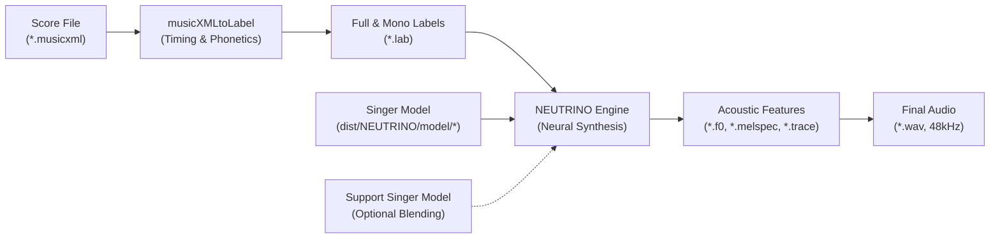
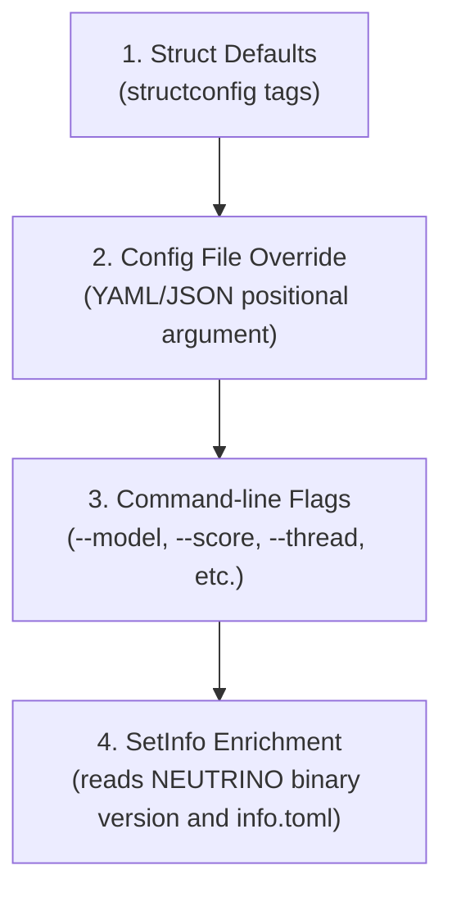
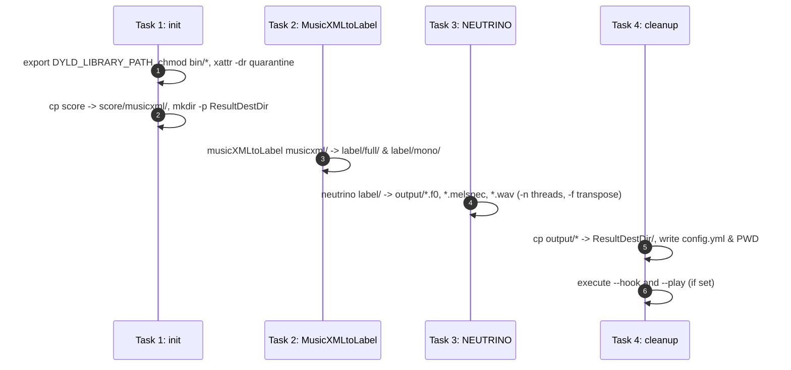
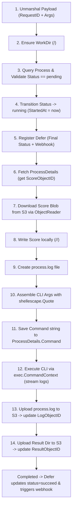
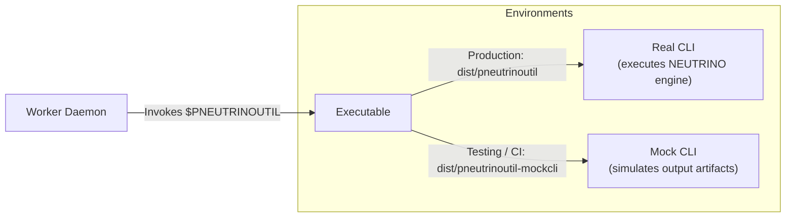

# NEUTRINO Pipeline & Synthesis Engine

This skill documents the NEUTRINO AI singing voice synthesis engine, how the `pneutrinoutil` CLI orchestrates synthesis tasks, how the background worker processes asynchronous rendering jobs, and how mock tooling enables robust automated testing in CI/test environments without proprietary neural network dependencies.

---

## 1. What is NEUTRINO?

[NEUTRINO](https://studio-neutrino.com/) is a proprietary AI singing voice synthesizer developed by STUDIO NEUTRINO. It takes standard MusicXML (`.musicxml`) music score files and renders studio-quality vocal audio (`.wav`) using deep neural networks.

### 1.1 Synthesis Pipeline Overview

The core synthesis engine transforms symbolic musical notation into acoustic waveforms through a sequential pipeline:



1. **Score Input (`.musicxml`)**: The input file describes pitch, duration, tempo, lyrics, dynamics, and phrasing.
2. **Timing & Phonetic Alignment (`musicXMLtoLabel`)**:
   - Converts the MusicXML score into time-aligned label files (`.lab`).
   - Generates full-context labels (containing phonetic contexts, phrasing, and metric position) and monophone labels.
3. **Neural Acoustic & Waveform Synthesis (`neutrino`)**:
   - Predicts fundamental frequency ($F_0$), mel-spectrogram acoustic features, and phonetic durations from the timing labels using deep neural network models.
   - Synthesizes final 48 kHz uncompressed WAV audio output.
4. **Intermediate Artifacts**:
   - `${BASENAME}.f0`: Pitch/fundamental frequency trajectory.
   - `${BASENAME}.melspec`: Mel-spectrogram spectral envelope.
   - `${BASENAME}.trace`: Acoustic model execution trace log.
   - `${BASENAME}.wav`: Synthesized audio waveform.

### 1.2 Singer Models (Voice Libraries)

Singer models contain neural network weights representing individual vocalists. In `pneutrinoutil`:
- Voice models reside in [`dist/NEUTRINO/model/<ModelName>/`](dist/NEUTRINO/model).
- Each model directory contains neural weights and an `info.toml` file describing the singer's metadata (e.g., name, version, and copyright).
- Models are provisioned locally via Ansible using `./task ansible` (see [Section 7](#7-singer-model-management)).
- Available singer models include:
  - `MERROW` (default singer in `pneutrinoutil`)
  - `KIRITAN` (東北きりたん)
  - `ITAKO` (東北イタコ)
  - `ZUNKO` (東北ずん子)
  - `METAN` (四国めたん)
  - `ZUNDAMON` (ずんだもん)
  - `CHANKO` (大江戸ちゃんこ)
  - `No.7` (SEVEN)

---

## 2. CLI Architecture (`cli/`)

The CLI is the core orchestration tool responsible for generating and executing the shell synthesis pipeline.

- **Main entry point**: [`cli/main.go`](cli/main.go)
- **Command definition**: [`cli/cmd/root.go`](cli/cmd/root.go) using Cobra.

```
pneutrinoutil [CONFIG_YML|CONFIG_JSON] [flags]
```

### 2.1 Subcommands

| Command | Source File | Purpose |
| :--- | :--- | :--- |
| `root` | [`cli/cmd/root.go`](cli/cmd/root.go) | Run synthesis pipeline from flags or config file |
| `info` | [`cli/cmd/info.go`](cli/cmd/info.go) | Inspect NEUTRINO engine version and installed singer models |
| `skeleton` | [`cli/cmd/skeleton.go`](cli/cmd/skeleton.go) | Dump default configuration template (`config.yml` or JSON with `--json`) |
| `version` | [`cli/cmd/version.go`](cli/cmd/version.go) | Print CLI version and git revision |

### 2.2 Configuration Structure (`cli/ctl/config.go`)

The configuration struct [`Config`](cli/ctl/config.go#L26-L39) supports dual YAML/JSON serialization, command-line flag reflection via [`github.com/berquerant/structconfig`](https://github.com/berquerant/structconfig), and environment variable binding:

```go
type Config struct {
    Description      string `json:"desc" yaml:"desc" name:"desc" usage:"description of config"`
    // Project settings
    Score            string `json:"score" yaml:"score" name:"score" usage:"score file, required"`
    NumThreads       int    `json:"thread" yaml:"thread" name:"thread" usage:"number of parallel in session" default:"4"`
    // NEUTRINO
    ModelDir         string `json:"model" yaml:"model" name:"model" usage:"singer" default:"MERROW"`
    SupportModelDir  string `json:"supportModel" yaml:"supportModel" name:"supportModel" usage:"support singer"`
    Transpose        int    `json:"transpose" yaml:"transpose" name:"transpose" usage:"change the key and estimate" default:"0"`
    // Info (dynamically populated by SetInfo)
    NeutrinoVersion  string `json:"neutrinoVersion" yaml:"neutrinoVersion"`
    ModelData        any    `json:"modelData" yaml:"modelData"`
    SupportModelData any    `json:"supportModelData" yaml:"supportModelData"`
}
```

### 2.3 Flag Precedence & Loading Sequence

When `pneutrinoutil` runs, configuration values resolve with the following precedence (highest to lowest):



1. **Defaults**: Initialized from struct tags (`default:"MERROW"`, `default:"4"`, etc.) via `ctl.NewDefaultConfig()`.
2. **File Configuration**: If a positional argument is provided (`args[0]`), it is parsed as YAML (falling back to JSON).
3. **Flags**: Explicit CLI flags override file and default settings via `c.ApplyFlagValues(cmd.Flags())`.
4. **Metadata Enrichment**: `c.SetInfo(ctx, dir.NeutrinoDir())` queries the `neutrino` executable for its version and loads singer metadata from `dist/NEUTRINO/model/<ModelDir>/info.toml`.

### 2.4 Complete CLI Flags Reference

| Flag | Shorthand | Type | Default | Description |
| :--- | :--- | :--- | :--- | :--- |
| `--score` | | `string` | *(required)* | Path to input `.musicxml` score file |
| `--model` | | `string` | `"MERROW"` | Primary singer model name |
| `--supportModel` | | `string` | `""` | Support singer model for NEUTRINO v3 voice blending |
| `--thread` | | `int` | `4` | Parallel synthesis threads within session |
| `--transpose` | | `int` | `0` | Key change / transpose semitones (-12 to +12) |
| `--neutrinoDir` | `-n` | `string` | `"./dist/NEUTRINO"` | Path to NEUTRINO installation directory |
| `--workDir` | `-w` | `string` | `$HOME/.pneutrinoutil` | Working directory for intermediate files & results |
| `--dry` | | `bool` | `false` | Dry-run mode: print generated shell script without executing |
| `--play` | | `string` | `""` | Command to play output WAV after synthesis (WAV passed as 1st arg) |
| `--hook` | | `string` | `""` | Command to execute after synthesis (result dir passed as 1st arg) |
| `--list-tasks` | | `bool` | `false` | Print task names (`init`, `MusicXMLtoLabel`, `NEUTRINO`, `cleanup`) |
| `--include` | `-i` | `strings`| `[]` | Whitelist specific task names to execute |
| `--exclude` | `-e` | `strings`| `[]` | Blacklist specific task names from execution |
| `--shell` | `-s` | `string` | `"bash"` | Shell interpreter used to execute the task pipeline |
| `--env` | | `strings`| `[]` | Additional environment variables to expose (`all` for everything) |
| `--debug` | | `bool` | `false` | Enable debug log output |

---

## 3. Task Execution Pipeline (`cli/task/definition.go`)

The CLI translates high-level configuration into a sequential shell script managed by [`Generator.executableTasksV3`](cli/task/definition.go#L56-L132).

### 3.1 Directory Layout (`cli/task/dir.go`)

Directory paths are managed by [`task.Dir`](cli/task/dir.go):

```
${NEUTRINODIR}/
├── bin/                       # Executables: musicXMLtoLabel, neutrino
├── model/                     # Voice models: MERROW, KIRITAN, etc.
├── score/
│   ├── musicxml/              # Copied input score: ${BASENAME}.musicxml
│   └── label/
│       ├── full/              # Full-context labels: ${BASENAME}.lab
│       ├── mono/              # Monophone labels: ${BASENAME}.lab
│       └── timing/            # Timing labels: ${BASENAME}.lab
└── output/                    # Intermediate: *.f0, *.melspec, *.trace, *.wav

${WORKDIR}/
└── result/
    └── <ResultElement>/       # Final synthesis output destination
        ├── ${BASENAME}.musicxml
        ├── ${BASENAME}.wav
        ├── config.yml
        └── PWD
```

### 3.2 Result Directory Naming (`pkg/pathx/result.go`)

Output folders use a unique timestamped, salted name generated by [`ResultElement`](pkg/pathx/result.go#L20-L40):

$$\text{Format: } \texttt{<Basename>\_\_<YYYYMMDDHHMMSS>\emph{<UnixTimestamp>}\emph{<Salt>}}$$

- **Example**: `sample__20260919165320_1789890800_42105`
- **Basename**: Derived from score filename without extension (`pathx.Basename(Score)`).
- **Salt**: Random 16-bit integer (`uint16(rand.IntN(math.MaxUint16 + 1))`), or fixed salt `9101` in mock CLI.
- **Parser**: [`pathx.ParseResultElement`](pkg/pathx/result.go#L52-L82) parses the name back into its structured components using regular expressions.

### 3.3 The 4 Pipeline Tasks



#### Task 1: `init`
Prepares environment, permissions, and initial directories:
```bash
export DYLD_LIBRARY_PATH="$DYLD_LIBRARY_PATH"
chmod 755 <BinDir>/*
xattr -dr com.apple.quarantine "<BinDir>"
cp -f "${Score}" "<MusicXMLDir>/"
mkdir -p "${ResultDestDir}"
```
*Note: `xattr -dr com.apple.quarantine` strips macOS Gatekeeper download flags from the proprietary binaries.*

#### Task 2: `MusicXMLtoLabel`
Generates phonetic labels from the MusicXML score:
```bash
<BinDir>/musicXMLtoLabel \
  "<MusicXMLDir>/${BASENAME}.musicxml" \
  "<FullDir>/${BASENAME}.lab" \
  "<MonoDir>/${BASENAME}.lab"
```

#### Task 3: `NEUTRINO`
Runs neural network acoustic synthesis:
```bash
<BinDir>/neutrino \
  "<FullDir>/${BASENAME}.lab" \
  "<TimingDir>/${BASENAME}.lab" \
  "<OutputDir>/${BASENAME}.f0" \
  "<OutputDir>/${BASENAME}.melspec" \
  "<OutputDir>/${BASENAME}.wav" \
  "<ModelDir>/${ModelDir}/" \
  [-S "<ModelDir>/${SupportModelDir}/"] \
  -n ${NumThreads} \
  -f ${Transpose} \
  -i "<OutputDir>/${BASENAME}.trace" \
  -t
```
- `-n ${NumThreads}`: Parallel execution worker threads.
- `-f ${Transpose}`: Key shift in semitones (0 for original pitch).
- `-S <dir>`: Optional secondary model for NEUTRINO v3 voice style blending.
- `-i <trace>`: Acoustic model execution trace output.
- `-t`: Timing estimation flag.

#### Task 4: `cleanup`
Packages all generated files into the isolated result folder:
```bash
cp <OutputDir>/${BASENAME}.* "<MusicXMLDir>/${BASENAME}.musicxml" "${ResultDestDir}/"
cat <<EOS > "${ResultDestDir}/config.yml"
<YAML-serialized Config>
EOS
echo "<PWD>" > "${ResultDestDir}/PWD"

if [ -n "$Hook" ] ; then
  $Hook "${ResultDestDir}"
fi
if [ -n "$Play" ] ; then
  result_wav="${ResultDestDir}/${BASENAME}.wav"
  $Play "${result_wav}"
fi
```

---

## 4. Background Worker Task Pipeline (`pkg/task/task.go`)

When users submit jobs via the Web UI or REST API (`POST /v1/proc`), the server enqueues an asynchronous job into Redis via [Asynq](https://github.com/hibiken/asynq). The worker dequeues and executes the job via [`PneutrinoutilProcessor.ProcessStart`](pkg/task/task.go#L82-L248).

### 4.1 Task Definition & Payload

- **Task Type**: `pneutrinoutil:start` (`task.TypePneutrinoutilStart`)
- **Payload Struct**:
  ```go
  type PneutrinoutilStartPayload struct {
      RequestID string   `json:"rid"`
      Args      []string `json:"args"`
  }
  ```

### 4.2 The 14-Step Processor Pipeline



| Step | Operation | Key Function / Code | Purpose |
| :--- | :--- | :--- | :--- |
| **1** | **Unmarshal Payload** | `json.Unmarshal(t.Payload(), &payload)` | Extracts `RequestID` and CLI `Args`. |
| **2** | **Create WorkDir** | `pathx.EnsureDir(workDir)` | Creates isolated directory `<WorkDir>/<RequestID>`. |
| **3** | **Validate Status** | `p.ProcessGetter.GetProcessByRequestId` | Checks database record exists and status is `pending`. |
| **4** | **Mark Running** | `p.ProcessUpdater.UpdateProcess` | Sets `Status = running`, records `StartedAt = time.Now()`. |
| **5** | **Register Defer** | `defer func() { p.updateProcessStatus(...); p.webhook(...) }()` | Ensures final status (`succeed`/`failed`), `CompletedAt`, and webhook notification are recorded even on panic/failure. |
| **6** | **Fetch Details** | `p.ProcessDetailsGetter.GetProcessDetails` | Retrieves `ScoreObjectID` from `process_details`. |
| **7** | **Download Score** | `p.ObjectReader.ReadObject(ctx, details.ScoreObjectID)` | Streams score blob from object storage (S3/SeaweedFS). |
| **8** | **Write Local Score** | `io.Copy(f, score.Blob)` | Writes `<WorkDir>/<RequestID>/<basename>.musicxml`. |
| **9** | **Create Log File** | `os.Create(filepath.Join(workDir, "process.log"))` | Prepares log sink for stdout and stderr streaming. |
| **10** | **Assemble Arguments** | `p.generateArgs(&payload, workDir, scorePath)` | Quotes args with `shellescape.Quote` (`--desc`, `--neutrinoDir`, `--workDir`, `--score`, `--env all`, `--shell`, etc.). |
| **11** | **Record Command** | `p.ProcessDetailsUpdater.UpdateProcessDetails` | Stores formatted command line in `ProcessDetails.Command`. |
| **12** | **Execute CLI** | `cmd := exec.CommandContext(ctx, p.Pneutrinoutil, args...)` | Runs synthesis CLI binary; streams stdout/stderr to `process.log`. |
| **13** | **Upload Log** | `p.uploadLog(ctx, logPath, resultObjectPath)` | Uploads `process.log` to S3; links `ProcessDetails.LogObjectID`. |
| **14** | **Upload Results** | `p.uploadResults(...)` via `p.findResultDir` | Uploads generated `.wav`, `.musicxml`, and `config.yml` to S3; links `ProcessDetails.ResultObjectID`. |

### 4.3 Injected Dependencies

[`PneutrinoutilProcessorParams`](pkg/task/task.go#L50-L66) enforces loose coupling through interfaces defined in `pkg/repo` and `pkg/infra`:

```go
type PneutrinoutilProcessorParams struct {
    Pneutrinoutil         string
    NeutrinoDir           string
    WorkDir               string
    Shell                 string
    Bucket                string
    BasePath              string
    Env                   []string

    Webhooker             infra.Webhooker            // Optional webhook notifier
    ObjectReader          repo.ObjectReader          // S3/FS object reader
    ObjectWriter          repo.ObjectWriter          // S3/FS object writer
    ProcessDetailsGetter  repo.ProcessDetailsGetter  // DB process details retrieval
    ProcessDetailsUpdater repo.ProcessDetailsUpdater // DB process details update
    ProcessGetter         repo.ProcessGetter         // DB process retrieval
    ProcessUpdater        repo.ProcessUpdater        // DB process update
}
```

---

## 5. Worker Architecture (`worker/`)

The background worker daemon connects Redis task queues with local OS synthesis execution.

- **Main entry point**: [`worker/main.go`](worker/main.go)
- **Server loop**: [`worker/worker/worker.go`](worker/worker/worker.go)
- **Configuration**: [`worker/config/config.go`](worker/config/config.go)

### 5.1 Concurrency & Queue Configuration

In [`worker/worker/worker.go`](worker/worker/worker.go#L81-L92):
```go
s.srv = asynq.NewServer(
    redisOpt,
    asynq.Config{
        Concurrency: s.c.Concurrency, // Default: 1
        Queues: map[string]int{
            "default": 10,           // Priority 10
        },
        ShutdownTimeout: s.c.ShutdownPeriod(), // Default: 10s
        Logger:          NewAsynqLogger(alog.L()),
        LogLevel:        s.c.AsynqLogLevel(),
    },
)
```

> [!IMPORTANT]
> **Default Concurrency is 1**: NEUTRINO synthesis is computationally heavy (utilizing multi-threaded neural networks that max out CPU/GPU resources). Setting worker concurrency to 1 guarantees jobs execute sequentially, preventing out-of-memory crashes and CPU thrashing on the synthesis host.

### 5.2 Why the Worker Runs on the Host (NOT in Docker/K8s)

In the `pneutrinoutil` architecture, **MySQL, Redis, SeaweedFS, Echo Server, and UI all run inside Kubernetes (Kind)**, but **the Worker runs directly on the macOS host**:
1. **Proprietary Binaries**: NEUTRINO is distributed as native macOS Mach-O or Linux binaries. On macOS, it links against native system dynamic libraries via `DYLD_LIBRARY_PATH`.
2. **Audio & Accelerator Drivers**: Running natively on the host provides direct access to system audio frameworks, CPU vector instructions (AVX/NEON), and avoids container virtualization overhead.
3. **Hybrid Setup**: The worker connects to the Kubernetes services via port forwards (`localhost:3306` for MySQL, `localhost:6379` for Redis, `localhost:9000` for SeaweedFS S3).

### 5.3 Host Worker Lifecycle Management (`bin/k8s-worker.sh`)

The host worker process is managed using [`bin/k8s-worker.sh`](bin/k8s-worker.sh):

```bash
# Start background worker on host
./task run:start-k8s-worker
# or directly:
./bin/env.sh ./bin/k8s-worker.sh start

# Stop background worker
./task run:stop-k8s-worker
# or directly:
./bin/env.sh ./bin/k8s-worker.sh stop

# Rebuild CLI & Worker and restart process
./task run:reload-k8s-worker
```

- **PID tracking**: Saved to `tmp/k8s-worker.pid`.
- **Logs**: Streamed to `tmp/k8s-worker.log`.

---

## 6. Mock CLI Testing Strategy

Because NEUTRINO binaries and multi-gigabyte singer models are proprietary, they cannot be checked into Git, distributed openly, or executed in continuous integration (CI) environments like GitHub Actions or isolated Linux containers.

`pneutrinoutil` solves this by introducing a **drop-in mock CLI simulation**:



### 6.1 Mock CLI Implementation (`mockcli/main.go`)

[`mockcli/main.go`](mockcli/main.go) behaves identically to the real CLI flag parser without performing neural network operations:
- Inherits the exact same CLI flags via `cli.InitFlags(rootCmd)`.
- Parses configuration with `cli.NewConfig(cmd, args)`.
- Creates the standardized result directory `<workDir>/result/<ResultElement>` using fixed salt `9101`.
- Copies the input score file to `<resultDir>/${BASENAME}.musicxml`.
- Generates `<resultDir>/config.yml` containing the marshaled configuration.
- Creates an empty output audio file `<resultDir>/${BASENAME}.wav`.
- **Simulation flags**:
  - `--duration <duration>`: Simulates synthesis latency (sleeps for the given duration).
  - `--fail`: Forces exit code 1 to test failure handling in worker pipelines.

### 6.2 Dynamic Binary Injection via `bin/env.sh`

The worker chooses which binary to execute via the `--pneutrinoutil` flag, which defaults to `./dist/pneutrinoutil` or the `PNEUTRINOUTIL` environment variable.

In [`bin/env.sh`](bin/env.sh#L16), setting `TEST=true` automatically substitutes the real engine with the mock CLI:

```bash
if [[ "$TEST" = "true" ]] ; then
    export PNEUTRINOUTIL="${d}/dist/pneutrinoutil-mockcli"
    # ... test DB, Redis, and S3 credentials ...
fi
```

### 6.3 Test Data Generator (`gendata/main.go`)

[`gendata/main.go`](gendata/main.go) automates end-to-end load generation and verification:
- Reads score basenames from `stdin`.
- Submits each score via multipart `POST /v1/proc` to the REST API server.
- Polls `GET /v1/proc/:id/detail` until the process status transitions to `succeed` or `failed`.
- Used directly in E2E integration tests ([`tests/e2e_test.go`](tests/e2e_test.go)).

### 6.4 Building the Mock Tools

Build the mock tools using `./task`:
```bash
./task build:mockcli    # Outputs dist/pneutrinoutil-mockcli
./task build:gendata    # Outputs dist/pneutrinoutil-gendata
```

---

## 7. Singer Model Management

### 7.1 Ansible Provisioning (`playbook/`)

NEUTRINO engine binaries and voice libraries are provisioned using Ansible playbooks:

```bash
# Provision engine binaries and configured singer models
./task ansible

# Perform a dry-run check
./task ansible:dry
```

The playbook structure:
- [`playbook/main.yml`](playbook/main.yml): Orchestrates roles `download/base`, `download/singer`, and `build/base`.
- [`playbook/group_vars/locals/vars.yml`](playbook/group_vars/locals/vars.yml): Defines NEUTRINO engine version (e.g., `v3.0.4`) and the list of singers to install.
- [`playbook/roles/download/base/tasks/main.yml`](playbook/roles/download/base/tasks/main.yml): Downloads the engine archive from `studio-neutrino.com`, unzips it into `dist/NEUTRINO`, and sets `chmod 0755` on binaries.
- [`playbook/roles/download/singer/tasks/singer.yml`](playbook/roles/download/singer/tasks/singer.yml): Downloads each singer library zip, extracts it, and installs it into `dist/NEUTRINO/model/`.

### 7.2 Model Directory Layout & Metadata

Each voice model is installed into its own directory under `dist/NEUTRINO/model/<ModelName>/`:

```
dist/NEUTRINO/model/MERROW/
├── info.toml          # Singer metadata (parsed by BurntSushi/toml)
├── acoustic/          # Neural acoustic model weights
└── timing/            # Neural timing model weights
```

Sample [`info.toml`](cli/info/model.go#L45-L51) metadata parsed by `pneutrinoutil`:
```toml
name = "MERROW"
version = "v3.0.4"
developer = "STUDIO NEUTRINO"
description = "NEUTRINO Standard Vocal Library"
```

### 7.3 Model Inspection via CLI (`cli/info/`)

The CLI `info` command queries engine details:
```bash
./dist/pneutrinoutil info --neutrinoDir ./dist/NEUTRINO
```

Implementation details:
- **Version Detection** ([`cli/info/neutrino.go`](cli/info/neutrino.go)): Runs the `neutrino` executable with `DYLD_LIBRARY_PATH` and extracts the version string from the first line of output.
- **Model Scanning** ([`cli/info/model.go`](cli/info/model.go)): Traverses `dist/NEUTRINO/model/*` directories and parses each singer's `info.toml`.

Sample JSON output from `pneutrinoutil info`:
```json
{
  "version": "1.0.0",
  "revision": "e3b8a1c",
  "neutrino": {
    "version": "v3.0.4",
    "models": [
      {
        "id": "MERROW",
        "data": {
          "name": "MERROW",
          "version": "v3.0.4"
        }
      },
      {
        "id": "KIRITAN",
        "data": {
          "name": "東北きりたん",
          "version": "v3.0.4"
        }
      }
    ]
  }
}
```

### 7.4 Multi-Model Blending (NEUTRINO v3)

NEUTRINO v3 introduces voice blending between two models:
- **`--model`**: Defines the primary voice library.
- **`--supportModel`**: Defines an optional secondary voice library.

When `--supportModel` is specified, `Generator.executableTasksV3` in [`cli/task/definition.go`](cli/task/definition.go#L99-L104) appends the `-S` parameter to the `neutrino` command invocation:
```bash
-S "./model/${SupportModelDir}/"
```
This instructs the neural synthesizer to interpolate vocal characteristics, allowing expressive hybrid vocalizations.
