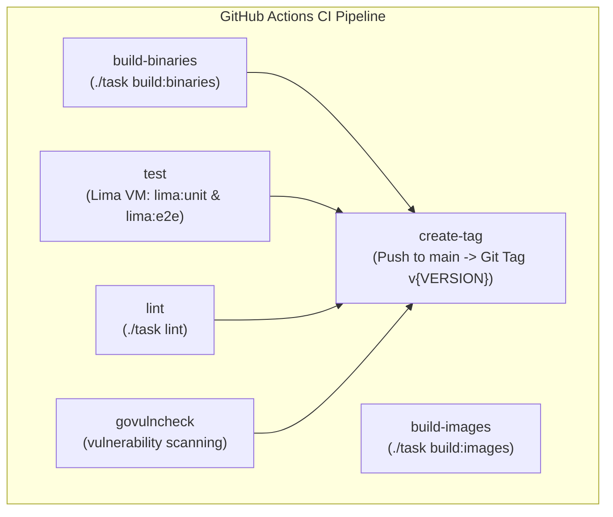

# Testing Patterns and Conventions

This guide documents the testing conventions, architectural patterns, mock strategies, and verification workflows for the `pneutrinoutil` project.

---

## 1. Testing Commands

All testing and verification workflows are standardized using the `./task` runner (which invokes [mise](mise.toml) tasks under the hood):

| Command | What it does |
| :--- | :--- |
| `./task test:unit` | Run all Go unit tests with coverage (`go test -cover ./...`, excluding `tests/` and `tmp/`) |
| `./task test:e2e` | Run E2E integration tests (requires running Kind cluster + worker) |
| `./task lima:unit` | Run unit tests inside Lima VM (CI-equivalent environment) |
| `./task lima:e2e` | Run E2E tests inside Lima VM |
| `./task ui-lint` | TypeScript type checking for UI code (`pnpm run typecheck` in `ui/`) |

### Additional Test Utilities and Flags

- **Clean Test Data**:
  ```bash
  ./task test:drop-data
  ```
  Drops and resets the test databases across Redis (DB 10), S3 bucket (`test`), and MySQL database (`test`).
- **Parallelism**: Control test runner parallelism using `TEST_PARALLEL`:
  ```bash
  TEST_PARALLEL=4 ./task test:unit
  ```
- **Verbose Output**: Enable verbose logging and disable test caching with `DEBUG=1`:
  ```bash
  DEBUG=1 ./task test:unit
  ```
- **Skip Cluster Deployment**: When running tests against an already active Kind cluster:
  ```bash
  SKIP_DEPLOY=true ./task test:e2e
  ```

---

## 2. Go Unit Test Conventions

### Black-Box Test Packages
Unit tests in `pneutrinoutil` **MUST** use separate test packages named with the `_test` suffix:
- Define tests using `package <pkg>_test` instead of `package <pkg>`.
- This ensures tests only access exported types, functions, and methods, verifying the package's public API surface rather than unexported internal implementation details.

**Concrete Examples Across the Codebase:**
- [`pkg/infra/db_test.go`](pkg/infra/db_test.go) uses `package infra_test` (imports [`pkg/infra`](pkg/infra))
- [`pkg/pathx/path_test.go`](pkg/pathx/path_test.go) uses `package pathx_test` (imports [`pkg/pathx`](pkg/pathx))
- [`cli/ctl/config_test.go`](cli/ctl/config_test.go) uses `package ctl_test` (imports [`cli/ctl`](cli/ctl))
- [`server/handler/common_test.go`](server/handler/common_test.go) uses `package handler_test` (imports [`server/handler`](server/handler))

### Assertion Library
Use [`github.com/stretchr/testify/assert`](https://github.com/stretchr/testify) rather than `require` or raw `if` checks:

```go
assert.Nil(t, err)
assert.Equal(t, expected, actual)
assert.True(t, condition)
assert.Contains(t, str, substr)
assert.NotEmpty(t, val)
assert.Len(t, slice, expectedLen)
```

> [!TIP]
> When subsequent test assertions depend on earlier steps succeeding (e.g., non-nil pointers or error checking), guard further execution by checking the assertion return value:
> ```go
> if !assert.Nil(t, err) {
>     return
> }
> ```

### Table-Driven Tests
Structure tests using table-driven test cases with subtests via `t.Run(tc.title, ...)`:

```go
for _, tc := range []struct {
    title    string
    input    string
    expected string
    err      bool
}{
    {
        title:    "valid input",
        input:    "test",
        expected: "result",
    },
    {
        title: "invalid input",
        input: "",
        err:   true,
    },
} {
    t.Run(tc.title, func(t *testing.T) {
        result, err := Function(tc.input)
        if tc.err {
            assert.NotNil(t, err)
            return
        }
        assert.Nil(t, err)
        assert.Equal(t, tc.expected, result)
    })
}
```

### Setup and Teardown
- Use helper functions `setUp(t *testing.T)` and `tearDown(t *testing.T, ...)`.
- Mark all test helper functions with `t.Helper()` so failures report the caller's line number instead of the helper's.
- Use `t.TempDir()` for filesystem isolation; directories created by `t.TempDir()` are automatically cleaned up when the test finishes.

**Setup & Teardown Pattern (from [`pkg/infra/db_test.go`](pkg/infra/db_test.go)):**
```go
func setUp(t *testing.T) *sql.DB {
    t.Helper()
    db, err := sql.Open("mysql", os.Getenv("MYSQL_DSN"))
    if err != nil {
        t.Fatal(err)
    }
    if _, err := db.Exec(dropTestTableSql); err != nil {
        t.Fatal(err)
    }
    if _, err := db.Exec(createTestTableSql); err != nil {
        t.Fatal(err)
    }
    return db
}

func tearDown(t *testing.T, db *sql.DB) {
    t.Helper()
    _, _ = db.Exec(dropTestTableSql)
    _ = db.Close()
}

func TestConn(t *testing.T) {
    db := setUp(t)
    defer tearDown(t, db)
    // test body...
}
```

**Filesystem Isolation Pattern (from [`pkg/pathx/path_test.go`](pkg/pathx/path_test.go)):**
```go
func TestEnsure(t *testing.T) {
    root := t.TempDir()
    dir := filepath.Join(root, "dir")
    assert.Equal(t, pathx.EnotExist, pathx.Exist(dir))
    assert.Nil(t, pathx.EnsureDir(dir))
    assert.Equal(t, pathx.Edir, pathx.Exist(dir))
}
```

---

## 3. E2E Test Architecture

### Location and Structure
End-to-end integration tests live in [`tests/e2e_test.go`](tests/e2e_test.go) (in package `main`). They exercise the entire distributed system pipeline:
```
Client / Gendata CLI ──> Server (Echo v5) ──> Redis / MySQL / SeaweedFS (S3)
                                │
                                └──> Worker (Asynq) ──> Mock CLI (dist/pneutrinoutil-mockcli)
```

### Prerequisites
Before running `./task test:e2e`:
1. **Kind Cluster Running**: Infrastructure services deployed with test configurations (`./task k8s:test` or `./task k8s`).
2. **Worker Process Running on Host**: Started using test environment parameters (`TEST=true ./bin/env.sh ./bin/k8s-worker.sh start`).
3. **Mock CLI Binary Built**: Located at `dist/pneutrinoutil-mockcli` (`./task build:mockcli`).
4. **Test Data Generator Built**: Located at `dist/pneutrinoutil-gendata` (`./task build:gendata`).

### Test Flow
The test suite in [`TestE2E`](tests/e2e_test.go#L103) executes the following sequence:

1. **Health Check Polling**: Waits for `GET /v1/health` to return `200 OK` using `assert.EventuallyWithT`.
2. **Job Submission**: Submits a `.musicxml` score through `dist/pneutrinoutil-gendata` via `POST /v1/proc`, capturing the returned `X-Request-Id`.
3. **Wait for Processing**: The test data generator polls `GET /v1/proc/{id}/detail` until the worker transitions the job status (`pending` → `running` → `succeed`).
4. **Verify Metadata**: Fetches `GET /v1/proc/{id}/detail` and validates `Status == "succeed"`, `RequestID`, and `Basename`.
5. **Verify Config**: Fetches `GET /v1/proc/{id}/config` and validates the parsed [`ctl.Config`](cli/ctl/config.go) (`Score`, `Description`, `Basename`).
6. **Verify Artifacts**: Downloads and validates generated artifacts:
   - `GET /v1/proc/{id}/musicxml`: Exact score content uploaded.
   - `GET /v1/proc/{id}/wav`: Generated WAV audio file.
   - `GET /v1/proc/{id}/log`: Synthesis execution log.
7. **Verify Search**: Exercises `GET /v1/proc/search` testing query filters:
   - Prefix filter: `prefix=a`
   - Status filter: `status=running`
   - Timestamp range: `start={unix}&end={unix}`
   - Pagination and ordering: `limit=2` (ordered by `created_at DESC`)

### Polling Pattern
For asynchronous readiness and status transitions, tests use `assert.EventuallyWithT`:

```go
const (
    eventuallyWaitForMax = time.Second * 5
    eventuallyTick       = time.Millisecond * 300
)

func eventually(t *testing.T, condition func(c *assert.CollectT), msgAndArgs ...any) bool {
    return assert.EventuallyWithT(t, condition, eventuallyWaitForMax, eventuallyTick, msgAndArgs...)
}

// Usage in healthcheck
eventually(t, func(c *assert.CollectT) {
    r, err := http.Get(newUrl("/health"))
    if !assert.Nil(c, err) {
        return
    }
    defer r.Body.Close()
    assert.Equal(c, http.StatusOK, r.StatusCode)
}, "healthcheck")
```

---

## 4. Mock CLI Strategy

### Why Mock?
The NEUTRINO engine is a proprietary neural network singing synthesizer requiring large model files and platform-specific binaries that are not available in CI runners. The mock CLI allows running full integration and E2E tests without neural network evaluation.

### How It Works
- Implemented in [`mockcli/main.go`](mockcli/main.go).
- Accepts identical command-line flags as the real CLI (`cli.InitFlags(rootCmd)`) plus testing flags:
  - `--fail`: Simulates execution failure by terminating with exit code 1.
  - `--duration <duration>`: Simulates synthesis latency by sleeping before generating output.
- Instead of calling NEUTRINO binaries, it creates expected output artifacts inside the result directory `result/<ResultElement>/`:
  - `config.yml`: Execution configuration serialized to YAML.
  - `<basename>.musicxml`: Copy of the input score file.
  - `<basename>.wav`: Generated empty audio placeholder.
- Built via `./task build:mockcli` to `dist/pneutrinoutil-mockcli`.

### Test Environment Switching
Environment switching is managed by [`bin/env.sh`](bin/env.sh). When `TEST=true`, it overrides runtime settings:
```bash
if [[ "$TEST" = "true" ]] ; then
    export MYSQL_DATABASE="$TEST_MYSQL_DATABASE"   # test
    export MYSQL_USER="$TEST_MYSQL_USER"           # test
    export MYSQL_PASSWORD="$TEST_MYSQL_PASSWORD"   # test
    export REDIS_DB="$TEST_REDIS_DB"               # 10
    export STORAGE_BUCKET="$TEST_STORAGE_BUCKET"   # test
    export MYSQL_DSN="$TEST_MYSQL_DSN"
    export REDIS_DSN="$TEST_REDIS_DSN"
    export PNEUTRINOUTIL="${d}/dist/pneutrinoutil-mockcli"
    worker_work_dir="$(mktemp -d)"
    export WORKDIR="$worker_work_dir"
fi
```
The worker invokes `$PNEUTRINOUTIL`, seamlessly executing the mock CLI instead of the real NEUTRINO wrapper.

### Test Data Generation
- Utility [`gendata/main.go`](gendata/main.go) (built to `dist/pneutrinoutil-gendata`):
  - Reads basenames from standard input.
  - Sends multipart HTTP POST requests to `/v1/proc`.
  - Concurrently polls `GET /v1/proc/{id}/detail` using `golang.org/x/sync/errgroup` until all submitted jobs report `succeed` or `failed`.
- Script [`bin/mockdata.sh`](bin/mockdata.sh) provides a command-line helper for populating mock data batches:
  ```bash
  ./bin/mockdata.sh 5 sample_score "score content"
  ```
  Supports `FAIL=true` and `DURATION=2s` environment variables for fault-tolerance and latency testing.

---

## 5. Test Database/Storage Isolation

To ensure that tests never corrupt or conflict with local development data, production and test environments use completely separate databases, buckets, and Redis namespaces:

| Resource | Production | Test |
| :--- | :--- | :--- |
| **MySQL Database** | `pneutrinoutil` | `test` |
| **Redis DB** | `1` | `10` |
| **S3 Bucket** | `pneutrinoutil` | `test` |

### Resetting Test Data
Reset test resources using [`bin/ddl.sh`](bin/ddl.sh) or `./task test:drop-data`:

```bash
# Individual drops via ddl.sh
./bin/ddl.sh drop mysql test
./bin/ddl.sh drop s3 test
./bin/ddl.sh drop redis 10

# Drop all test data in one command
./task test:drop-data
```

### Helm Test Values
When deploying the Kind cluster for testing (`./task k8s:test`), Helm deploys with [`test-values.yaml`](test-values.yaml):
```yaml
redis:
  db: 10

s3:
  bucket: test
  asDeployment: true

mysql:
  database: test
  user: test
  password: test
  asDeployment: true
```

---

## 6. CI Pipeline

Continuous integration runs on GitHub Actions in [`.github/workflows/ci.yml`](.github/workflows/ci.yml):



### Pipeline Jobs
1. **`build-binaries`**: Builds all Go binaries (`cli`, `server`, `worker`, `mockcli`, `gendata`).
2. **`build-images`**: Builds container images with `docker buildx bake`.
3. **`test`**: Provisions a **Lima VM** to run unit and E2E tests in a native Linux VM:
   - `mise run lima:unit` (runs unit tests with `TEST_PARALLEL=4`)
   - `mise run lima:e2e` (runs E2E tests against Kind cluster)
4. **`lint`**: Runs the complete linting suite (`./task lint`: `yamllint`, `ls-lint`, `shellcheck`, `vet`, `golangci-lint`, `go-arch-lint`, `ui:build`, `ui:lint`).
5. **`govulncheck`**: Runs dependency vulnerability scanning against `go.mod`.
6. **`create-tag`**: On pushes to `main`, reads `VERSION` and publishes a matching git release tag (e.g. `v0.1.0`).

### Why Lima VM is Used in CI
In GitHub Actions runners, running MySQL 9.6 inside a Kind cluster (Docker-in-Docker) fails due to storage driver file-descriptor incompatibilities:
```
[ERROR] [MY-010338] [Server] Can't find error-message file '/usr/share/mysql-9.6/english/errmsg.sys'.
```
Even though the error-message file exists, the storage driver in nested container environments prevents the MySQL server binary from opening it. Running inside a Lima VM on the runner provides a clean, native virtualization layer with standard filesystem semantics, allowing Kind and MySQL 9.6 to run reliably.

---

## 7. Writing New Tests: Checklist

Before opening a pull request or completing a task, ensure new tests satisfy this checklist:

- [ ] **Black-Box Package**: Uses `package <name>_test` (e.g., `package domain_test`, not `package domain`).
- [ ] **Assertions**: Uses `github.com/stretchr/testify/assert` rather than `require` or custom error checks.
- [ ] **Table-Driven Design**: Uses table-driven slice of test structs with `t.Run(tc.title, func(t *testing.T) { ... })`.
- [ ] **Helper Attribution**: All helper functions call `t.Helper()` as their first statement.
- [ ] **Filesystem Isolation**: File operations use `t.TempDir()` rather than hardcoded `/tmp` paths.
- [ ] **Unit Test Verification**: Tests pass cleanly with `./task test:unit`.
- [ ] **Clean Tear Down**: Any integration tests creating persistent state (DB rows, files, network resources) register teardown actions (`defer tearDown(...)` or `t.Cleanup(...)`).
