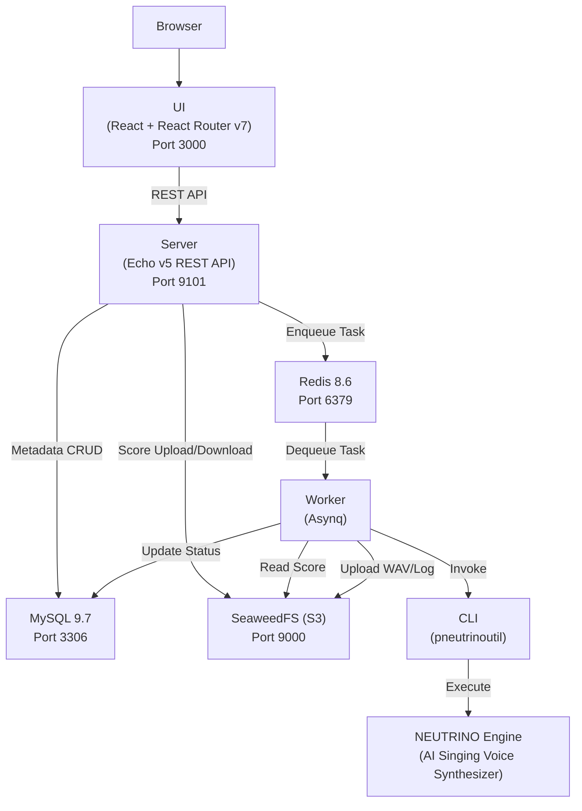
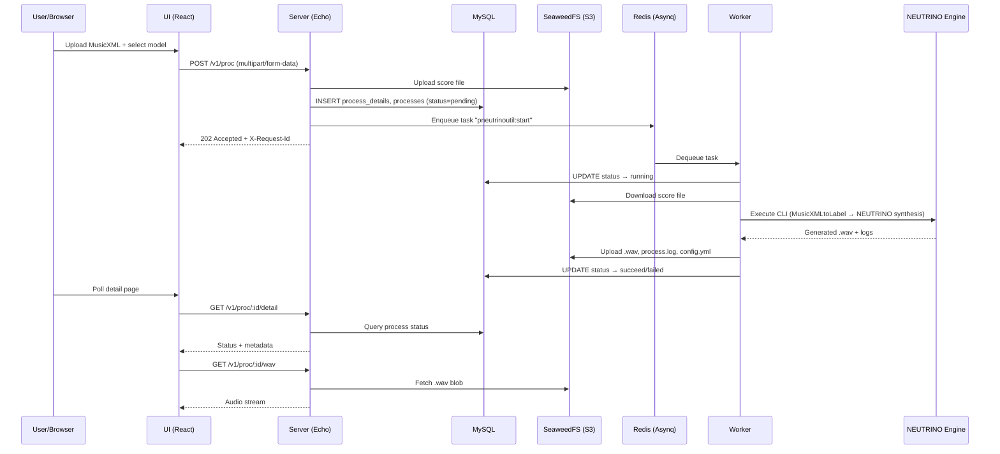
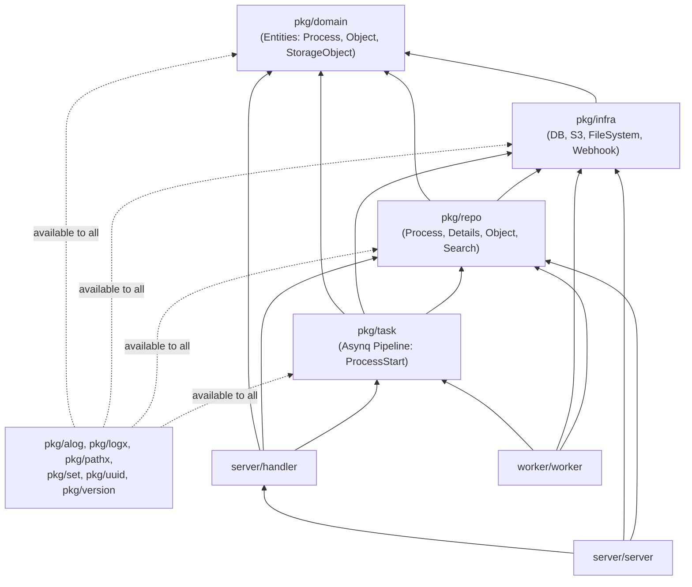
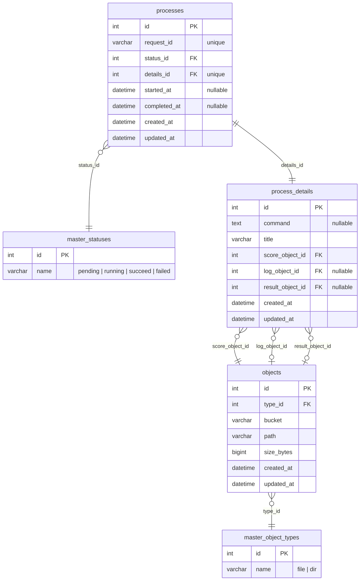

# AI Assistant Development Guide (`pneutrinoutil`)

This document provides guidelines and best practices for AI assistants developing, maintaining, and adding features to the `pneutrinoutil` project.

> **Agent Skills:** For deep dives into specific topics, see the specialized skills in [`.agent/skills/`](.agent/skills/).

---

## 1. Project Overview

`pneutrinoutil` is a monorepo providing utilities for [NEUTRINO](https://studio-neutrino.com/), an AI singing voice synthesizer. It enables batch rendering of `.musicxml` score files into `.wav` audio via a web interface, REST API, and CLI.

### Component Structure

| Directory | Technology | Purpose |
| :--- | :--- | :--- |
| `cli/` | Go (Cobra) | Command-line interface for batch rendering `.musicxml` → `.wav` |
| `mcp/` | Go (mcp-sdk, Cobra) | Model Context Protocol (MCP) server for AI assistants (stdio) |
| `server/` | Go (Echo v5) | HTTP REST API server with Swagger/OpenAPI documentation |
| `worker/` | Go (Asynq) | Background task worker processing asynchronous synthesis jobs via Redis |
| `ui/` | React 19, React Router v7, TypeScript, Vite | Web frontend for job submission, monitoring, and audio playback |
| `pkg/` | Go | Shared packages: domain models, infrastructure, repositories, task pipelines |
| `charts/` | Helm | Kubernetes deployment manifests (MySQL, Redis, SeaweedFS, Server, UI) |
| `playbook/` | Ansible | Provisioning NEUTRINO engine binaries and singer voice models |

---

## 2. Architecture

### 2.1 System Overview

### 2.2 Request Lifecycle (Data Flow)

### 2.3 Go Package Dependency Graph

Dependencies are enforced by [`go-arch-lint`](https://github.com/fe3dback/go-arch-lint) via [`.go-arch-lint.yml`](.go-arch-lint.yml).

**Key rules:**
- `pkg/domain` has **zero** internal dependencies (pure entities and enums).
- `pkg/infra` depends only on `domain` (DB connections, S3 client, webhook).
- `pkg/repo` depends on `domain` + `infra` (data access layer).
- `pkg/task` depends on `domain` + `infra` + `repo` (background job pipeline).
- `server/handler` may depend on `repo`, `task`, and `domain` — but never directly on `infra`.
- Common packages (`alog`, `logx`, `pathx`, `set`, `uuid`, `version`) are available to all layers.

### 2.4 Database Schema

Defined in [`charts/pneutrinoutil/templates/mysql/_helpers.tpl`](charts/pneutrinoutil/templates/mysql/_helpers.tpl):

### 2.5 REST API Endpoints

All endpoints are under `/v1`. Swagger UI is served at `/v1/swagger/index.html`.

| Method | Endpoint | Handler | Description |
| :--- | :--- | :--- | :--- |
| `GET` | `/v1/health` | `Health` | Health check (returns `"OK"`) |
| `GET` | `/v1/version` | `Version` | Server version and git revision |
| `GET` | `/v1/debug` | `Debug` | Dumps registered Echo routes |
| `GET` | `/v1/swagger/*` | Swagger UI | Interactive API documentation |
| `POST` | `/v1/proc` | `Start.Handler` | Submit synthesis job (multipart: `score`, `model`, `supportModel`, `transpose`) → 202 + `X-Request-Id` |
| `GET` | `/v1/proc/search` | `Search.SearchProcess` | Search processes (query: `limit`, `prefix`, `status`, `start`, `end`) |
| `GET` | `/v1/proc/:id/detail` | `Get.Detail` | Process status, timestamps, command |
| `GET` | `/v1/proc/:id/config` | `Get.Config` | Parsed `config.yml` from execution |
| `GET` | `/v1/proc/:id/musicxml` | `Get.MusicXML` | Download original MusicXML file |
| `GET` | `/v1/proc/:id/wav` | `Get.Wav` | Stream/download generated WAV audio |
| `GET` | `/v1/proc/:id/log` | `Get.Log` | Stream raw execution log |

---

## 3. Development Workflow & Task Execution Matrix

AI assistants **MUST** follow a strict **"Edit → Verify (Lint/Test/Build)"** loop. Editing files alone is not considered task completion.

Use the `./task` runner (which executes `mise run` under the hood) for running standardized commands based on the scenario:

### Scenario-Based Task Matrix

| Situation / Development Trigger | Command | Description |
| :--- | :--- | :--- |
| **Routine Full Verification** | `./task` | Runs linters, unit/integration tests, and builds all binaries in sequence. |
| **Go Code Modifications** | `./task test:unit` | Runs pure Go unit tests with coverage (`go test -cover`, no external dependencies). |
| **Infrastructure Integration Testing** | `./task test:integration` | Runs integration tests for DB and S3 infra against local Kubernetes (Kind). |
| **API Handler / Swagger Annotation Changes** | `./task gen:swag` | Generates Swagger docs in `server/docs` and updates TypeScript API client for UI. |
| **Frontend UI (TypeScript/React) Editing** | `./task ui-lint` | Runs TypeScript type checking (`typecheck`). |
| **End-to-End System Testing** | `./task test:e2e` | Runs E2E tests, verifying integration between Server, Worker, Redis, MySQL, and S3. |
| **Building Individual Binaries** | `./task build:cli` `./task build:server` `./task build:worker` `./task build:mcp` | Builds specific Go binaries to `dist/`. |
| **Building All Artifacts & Docker Images** | `./task build` | Builds all Go binaries and Docker images via `docker buildx bake`. |
| **Updating Go Module Dependencies** | `./task tidy` | Runs `go mod tidy` for Go module dependencies. |
| **Initial Project Setup / Environment Config** | `./task init` | Initializes local environment variables via `mise`. |
| **Deploying Local Kubernetes (Kind)** | `./task k8s` | Reloads Kind cluster, loads Docker images, and deploys via Helm. |
| **Stopping Local Kubernetes & Worker** | `./task k8s:stop` | Tears down local Kind cluster and stops background worker processes. |
| **Reloading K8s Worker Process** | `./task run:reload-k8s-worker` | Rebuilds CLI/Worker and restarts background K8s worker process. |
| **Provisioning NEUTRINO Engine & Singers** | `./task ansible` | Downloads and installs NEUTRINO binaries and singer voice models via Ansible. |
| **Cleaning Generated Files / Tools** | `./task gen:clean` | Removes generated Go files (`*_generated.go`) and binary tool caches. |

---

## 4. Component-Specific Guidelines

### A. Go Backend (`server/`, `worker/`, `pkg/`)
1. **Maintain Layered Architecture:**
   * Business logic and processing pipelines belong in [`pkg/domain`](pkg/domain) and [`pkg/task`](pkg/task).
   * Database queries and object storage operations belong in [`pkg/repo`](pkg/repo) and [`pkg/infra`](pkg/infra).
   * See skill: [`.agent/skills/go-architecture/SKILL.md`](.agent/skills/go-architecture/SKILL.md)
2. **API Changes & Swagger:**
   * When modifying handlers in [`server/handler`](server/handler), update the Swagger annotations accordingly, run `./task gen:swag` to update Swagger docs and client interfaces, and verify UI compatibility in `ui/`.
   * See skill: [`.agent/skills/api-swagger-workflow/SKILL.md`](.agent/skills/api-swagger-workflow/SKILL.md)
3. **Error Handling:**
   * Do not suppress errors or return silent fallbacks. Log errors with sufficient context and propagate them up the call chain.

### B. CLI Tool (`cli/`)
* When adding or updating CLI flags/parameters, update [`cli/README.md`](cli/README.md) with updated flag descriptions and usage examples.
* Ensure backward compatibility for NEUTRINO v2 and v3 parameters.
* See skill: [`.agent/skills/neutrino-pipeline/SKILL.md`](.agent/skills/neutrino-pipeline/SKILL.md)

### C. Web UI (`ui/`)
1. **Package Management:** Always use `pnpm`.
2. **Type Safety:** Ensure strong TypeScript typing for API request/response structures. Avoid using `any`. Run `./task ui-lint` after modifying UI code.
3. **UI/UX Excellence:** Maintain a modern, responsive interface using rich aesthetics (clean color palettes, micro-animations, clear status indicators for job processing and audio playback).

### D. MCP Server (`mcp/`)
1. **Transport:** Operates over `stdio` using official `mcp-sdk`. All application logs MUST be directed to `os.Stderr` to avoid corrupting the JSON-RPC stream on `os.Stdout`.
2. **Dual-Mode Execution:** Supports `standalone` (local NEUTRINO invocation) and `api` (`pneutrinoutil-server` REST API).
3. **Asynchronous Handshake for API Mode:** In `api` mode, the `synthesize` tool returns immediately (`wait: false` by default) with `requestId` to avoid timing out AI agent clients. The client monitors completion via `check_process`.

---

## 5. Golden Rules

1. **Never Guess Schemas or Definitions:** Always inspect authoritative source code for structs, interfaces, or DB schemas before writing code that consumes them.
2. **Log-First Diagnosis:** When encountering runtime or test failures, inspect the raw error logs first rather than forming blind hypotheses or masking errors.
3. **Preserve Contracts:** Ensure API endpoints, database schemas, and background job message payloads retain compatibility across components (`server`, `worker`, `ui`).
4. **Always Run Verification:** Never declare success without executing empirical verification (e.g., `./task test:unit`, `./task lint`, `./task build`).
5. **Keep Documentation Synced:** Update `AGENTS.md`, `README.md`, or relevant skill files whenever architectural changes or new configuration parameters are introduced.

---

## 6. Definition of Done Checklist

Before submitting changes, verify the following:

- [ ] `./task lint` (or `./task ui-lint` for UI changes) passes without errors or warnings.
- [ ] `./task test:unit` passes completely.
- [ ] `./task build` succeeds for all target binaries.
- [ ] `./task gen:swag` was executed if API endpoints/annotations were modified.
- [ ] New or modified code is accompanied by unit tests where appropriate.
- [ ] Documentation (`README.md`, Swagger annotations, etc.) has been updated.

---

## 7. Agent Skills Reference

Specialized skills are available in `.agent/skills/` for deep dives into specific areas:

| Skill | When to Use |
| :--- | :--- |
| [`neutrino-pipeline`](.agent/skills/neutrino-pipeline/SKILL.md) | Understanding NEUTRINO synthesis, CLI config, worker task pipeline, mock CLI testing |
| [`api-swagger-workflow`](.agent/skills/api-swagger-workflow/SKILL.md) | Adding/modifying REST API endpoints, Swagger annotations, TypeScript client generation |
| [`go-architecture`](.agent/skills/go-architecture/SKILL.md) | Package layering rules, adding new domain entities, code generation patterns |
| [`local-dev-environment`](.agent/skills/local-dev-environment/SKILL.md) | Kind cluster, Helm deployment, worker management, environment variables |
| [`testing-patterns`](.agent/skills/testing-patterns/SKILL.md) | Writing tests, E2E patterns, mock CLI strategy, test isolation |
